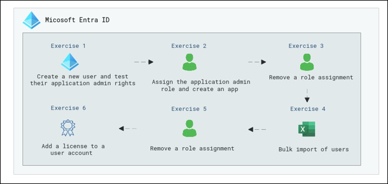

# Lab Scenario Preview: SC-300:  Microsoft Identity and Access Administrator

## Lab 01: Manage user roles

### Lab overview

In this lab, you will learn how to perform duties as an application administrator and create a new user, and assign the appropriate role.

### Objectives
  
After completing this lab, you will be able to complete the following Exercises:

-  Exercise 1 - Create a new user and test their application admin rights
-  Exercise 2 - Assign the application admin role and create an app
-  Exercise 3 - Remove a role assignment
-  Exercise 4 - Bulk import of users
-  Exercise 5 - Remove a user from Microsoft Entra ID
-  Exercise 6 - Add a  license to a user account

### Architecture Diagram

 

Once you understand the lab's content, you can start the Hands-on Lab by clicking the **Launch** button located in the top right corner. This will lead you to the lab environment and guide. You can also preview the full lab guide [here](https://experience.cloudlabs.ai/#/labguidepreview/43fffebe-13a2-4517-aae2-5ed59849e20a) if you want to go through detailed guide prior to launching lab environment.

