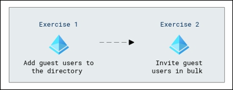

# Lab Scenario Preview: SC-300:  Microsoft Identity and Access Administrator

## Lab 05: Add guest users to the directory

### Lab overview

In this lab, you will learn how to add guest users to a directory which involves inviting external users, such as clients or partners, to access specific resources within your organization's directory,

### Objectives
  
After completing this lab, you will be able to complete the following exercises:

- Exercise 1 - Add guest users to the directory
- Exercise 2 - Invite guest users in bulk

### Architecture Diagram

   

Once you understand the lab's content, you can start the Hands-on Lab by clicking the **Launch** button located in the top right corner. This will lead you to the lab environment and guide. You can also preview the full lab guide [here](https://experience.cloudlabs.ai/#/labguidepreview/f432c576-6673-4ed9-8b5d-59b937876b1a) if you want to go through the detailed guide prior to launching lab environment.

