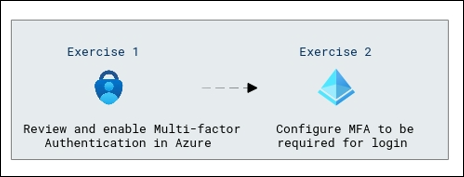

# Lab Scenario Preview: SC-300:  Microsoft Identity and Access Administrator

## Lab 08:  Enable Azure AD multi-factor authentication

### Lab overview

In this lab, you will learn the process of enhancing security by requiring users to provide two or more authentication factors. 

### Objectives
  
After completing this lab, you will be able to complete the following exercises:

- Exercise 1 - Review and enable Multi-factor Authentication in Azure
- Exercise 2 - Configure MFA to be required for login
  
### Architecture Diagram

   

Once you understand the lab's content, you can start the Hands-on Lab by clicking the **Launch** button located in the top right corner. This will lead you to the lab environment and guide. You can also preview the full lab guide [here](https://experience.cloudlabs.ai/#/labguidepreview/c2c5400b-f749-4601-8140-282f2ae69b6c) if you want to go through the detailed guide prior to launching lab environment.

