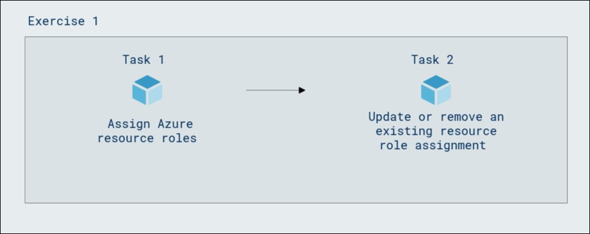

# Lab Scenario Preview: SC-300:  Microsoft Identity and Access Administrator 

## Lab 11: Assign Azure resource roles in Privileged Identity Management

### Lab overview

Microsoft Entra ID Privileged Identity Management (PIM) can manage the built-in Azure resource roles, as well as custom roles, including (but not limited to):

- Owner
- User Access Administrator
- Contributor
- Security Admin
- Security Manager

You need to make a user eligible for an Azure resource role.

### Lab objectives
In this lab, you will complete the following tasks:

+ Task 1: Assign Azure resource roles
+ Task 2: Update or remove an existing resource role assignment

### Architecture Diagram

   

Once you understand the lab's content, you can start the Hands-on Lab by clicking the **Launch** button located in the top right corner. This will lead you to the lab environment and guide. You can also preview the full lab guide [here](https://experience.cloudlabs.ai/#/labguidepreview/0520fca7-780d-47c2-bae3-b303ad2e66b7) if you want to go through detailed guide prior to launching lab environment.
