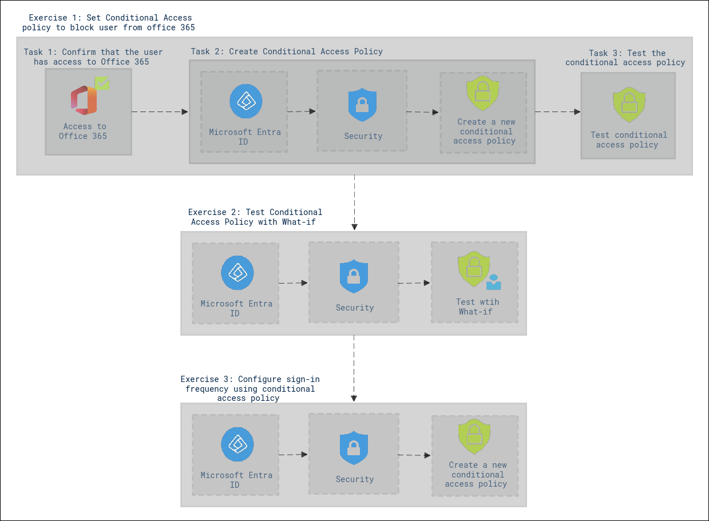

# Lab Scenario Preview: SC-300:  Microsoft Identity and Access Administrator

## Lab 13: Implement and test a conditional access policy

### Lab overview

In this lab, you'll acquire the practical expertise needed to set up an Azure Active Directory conditional access policy, which serves as a powerful tool to finely control and limit user access to internal applications. These policies can be tailored based on conditions like user attributes, device compliance, or location, allowing you to customize and enhance security measures according to your organization's specific requirements. By mastering this skill, you will be well-equipped to bolster your organization's cybersecurity defenses and compliance efforts, while also streamlining user access management for internal applications in a more efficient and secure manner.

### Objectives
  
After completing this lab, you will be able to:

- Set a conditional access policy to block an user from accessing Office 365
  - Create a conditional access policy
  - Test the conditional access policy
- Test conditional access policies with "What if"
  - Use What if to test conditional access policies
- Configure sign in frequency controls using a conditional access policy
  - Use the Azure Portal to configure conditional access

### Architecture Diagram

Once you understand the lab's content, you can start the Hands-on Lab by clicking the **Launch** button located in the top right corner. This will lead you to the lab environment and guide. You can also preview the full lab guide [here](https://experience.cloudlabs.ai/#/labguidepreview/7cd3cb40-4729-4dc8-bf02-4c50ddd6f13a) if you want to go through detailed guide prior to launching lab environment.
