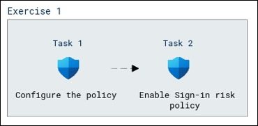

# Lab Scenario Preview: SC-300:  Microsoft Identity and Access Administrator

## Lab 14: Enable sign in and user risk policies

### Lab overview

In this lab, you will learn how to configure security measures in an identity and access management system to assess and respond to risks associated with user sign-ins.

### Objectives
  
After completing this lab, you will be able to complete the following exercises:

- Task 1 - Configure the policy
- Task 2 - Enable Sign-in risk policy
  
### Architecture Diagram

   

Once you understand the lab's content, you can start the Hands-on Lab by clicking the **Launch** button located in the top right corner. This will lead you to the lab environment and guide. You can also preview the full lab guide [here](https://experience.cloudlabs.ai/#/labguidepreview/21c0d9e9-4236-42fc-bf91-0df770c535a2) if you want to go through the detailed guide prior to launching lab environment.

