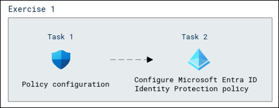

# Lab Scenario Preview: SC-300:  Microsoft Identity and Access Administrator

## Lab 15: Configure an Azure AD multi-factor authentication registration policy

### Lab overview

In this lab, you will learn how to configure multi-factor authentication registration policy which involves defining the specific rules and requirements for users when they set up multi-factor authentication.

### Objectives
  
After completing this lab, you will be able to complete the following tasks:

- Task 1 - Policy configuration
- Task 2 - Configure Microsoft Entra ID Identity Protection policy for MFA registration
  
### Architecture Diagram

   

Once you understand the lab's content, you can start the Hands-on Lab by clicking the **Launch** button located in the top right corner. This will lead you to the lab environment and guide. You can also preview the full lab guide [here](https://experience.cloudlabs.ai/#/labguidepreview/44ac5c1f-ad35-4ee9-a176-4f1717c0b1b7) if you want to go through the detailed guide prior to launching lab environment.

