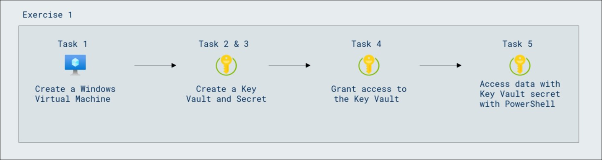

# Lab Scenario Preview: SC-300:  Microsoft Identity and Access Administrator

## Lab 16: Using Azure Key Vault for Managed Identities

### Lab overview
When you use managed identities for Azure resources, your code can get access tokens to authenticate to resources that support Azure AD authentication.  However, not all Azure services support Azure AD authentication. To use managed identities for Azure resources with those services, store the service credentials in Azure Key Vault, and use the managed identity to access Key Vault to retrieve the credentials.

### Lab objectives
In this lab, you will complete the following tasks:

+ Task 1 - Create a Windows Virtual Machine
+ Task 2 - Create a Key Vault
+ Task 3 - Create a secret
+ Task 4 - Grant access to Key Vault
+ Task 5 - Access data with Key Vault secret with PowerShell

### Architecture Diagram

   

Once you understand the lab's content, you can start the Hands-on Lab by clicking the **Launch** button located in the top right corner. This will lead you to the lab environment and guide. You can also preview the full lab guide [here](https://experience.cloudlabs.ai/#/labguidepreview/5621c9f9-1e31-4061-ab76-c1d3ef069096) if you want to go through detailed guide prior to launching lab environment.
