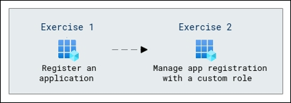

# Lab Scenario Preview: SC-300:  Microsoft Identity and Access Administrator

## Lab 19: Register an application

### Lab overview

In this lab, you will learn how to configure permissions, authentication settings, and other properties to define how the application can access and use Azure resources securely.

### Objectives
  
After completing this lab, you will be able to complete the following exercises:

- Exercise 1 - Register an application
- Exercise 2 - Manage app registration with a custom role
  
### Architecture Diagram

   

Once you understand the lab's content, you can start the Hands-on Lab by clicking the **Launch** button located in the top right corner. This will lead you to the lab environment and guide. You can also preview the full lab guide [here](https://experience.cloudlabs.ai/#/labguidepreview/a8cb6899-f03f-4959-a5bc-bbafc3ae2718) if you want to go through the detailed guide prior to launching lab environment.

