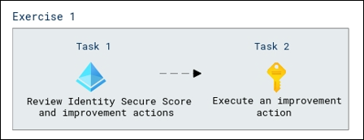

# Lab Scenario Preview: SC-300:  Microsoft Identity and Access Administrator

## Lab 28: Monitor and managed security posture with Identity Secure Score

### Lab overview

In this lab, you will learn how to  craft specific data queries to analyze and gain insights from Entra ID-related logs, events, or activities.

### Objectives
  
After completing this lab, you will be able to complete the following tasks:

+ Task 1: Review Identity Secure Score and improvement actions
+ Task 2: Execute an improvement action

  
### Architecture Diagram

   

Once you understand the lab's content, you can start the Hands-on Lab by clicking the **Launch** button located in the top right corner. This will lead you to the lab environment and guide. You can also preview the full lab guide [here](https://experience.cloudlabs.ai/#/labguidepreview/0e343c8b-44fe-4b75-9a27-59e3f62d4a7f) if you want to go through the detailed guide prior to launching lab environment.

