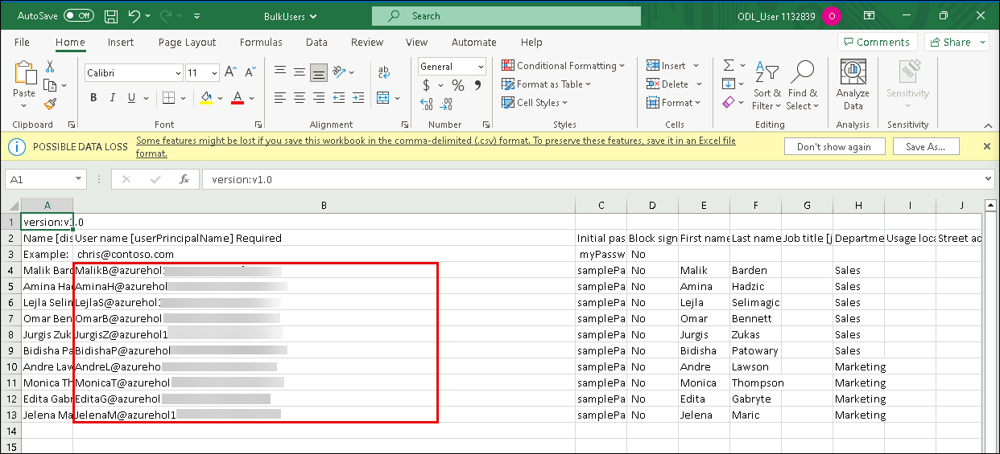
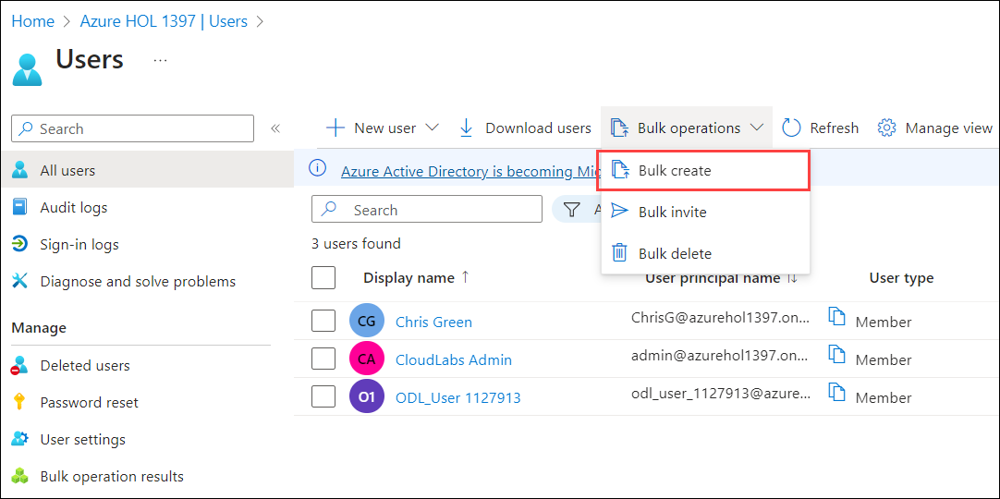
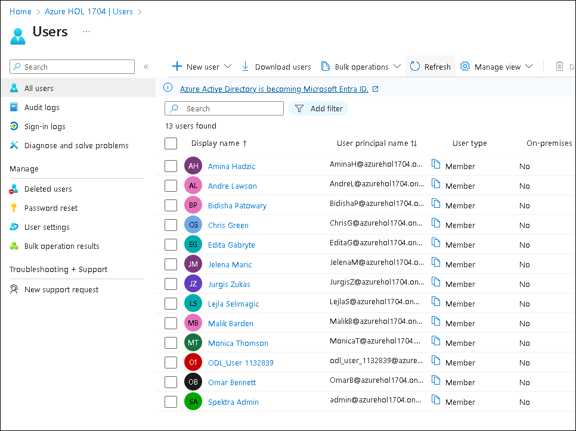
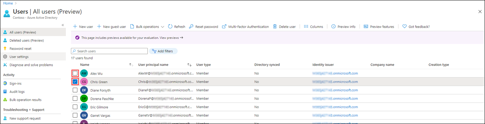
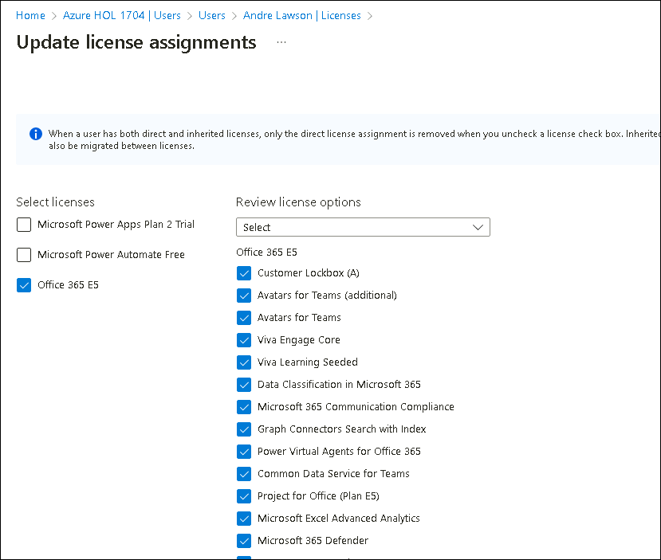
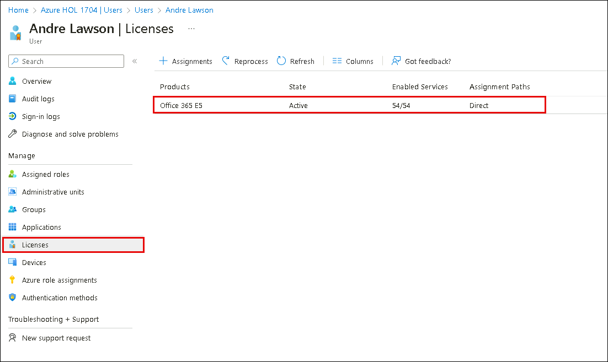

# Lab 01: Manage user roles

## Lab scenario

Your company recently hired a new employee who will perform duties as an application administrator. You must create a new user and assign the appropriate role.

#### Estimated time: 60 minutes

## Lab Objectives

After completing this lab, you will be able to complete the following :

-  Exercise 1 - Create a new user and test their application admin rights
-  Exercise 2 - Assign the application admin role and create an app
-  Exercise 3 - Remove a role assignment
-  Exercise 4 - Bulk import of users
-  Exercise 5 - Remove a user from Microsoft Entra ID
-  Exercise 6 - Add a  license to a user account

### Exercise 1 - Create a new user and test their application admin rights
  
  In this exercise, you will create  a new user account and verify their administrative privileges by testing their application access and control.

#### Task 1 - Add a new user

1. In the Azure portal, search for and  select **Microsoft Entra ID**.

2. In the left navigation menu, under **Manage**, select **Users**, then select **+ New User** and **Create new user**.

3. Mark the **Create user** button. Then, create a user with the following information:

    | **Setting**| **Value**|
    | :--- | :--- |
    | User name| ChrisG|
    | Name| Chris Green|
    | First name| Chris|
    | Last name| Green|

4. Mark the **Auto-generate password** option.

5. Copy the generated password to a location you can remember it for the next task.

   >**Note:** You will have to change the password upon first login to this account
   
   >**Note:** Copy the username Of Chris Green in order to login in the next task

6. Click on **Review + Create** and subsequently click on **Create**. The user is now created and registered to your organization.

#### Task 2 - Login and try to create an app

1. Launch a new InPrivate browser window.
2. Open the Azure Portal [https://portal.azure.com](https://portal.azure.com) as Chris Green.

    | **Setting**| **Value**|
    | :--- | :--- |
    | User name| ChrisG@`your domain name.com`|
    | Password| Enter the auto-generated password from previous task. |


3. Update your password.

    | **Setting**| **Value**|
    | :--- | :--- |
    | Current Password| Use auto-generated password|
    | New Password| Enter a unique and secure password |
    | Confirm Password| Reenter a unique and secure password |

    >**Note:** If you get a prompt to Enable MFA you can choose **Ask Later**.

4. If you see a **Welcome to Microsoft Azure** tour dialog, Select the **Maybe Later** button.

5. Search for and select **Enterprise applications** in the search dialog at the top of the screen.
7. Select on **+ New application**. Notice that **+ Create your own application** is unavailable.

9. Try Selecting on some of the other settings like **Application Proxy**, **User settings**, and others to see the **Chris Green** does not have rights.
10. Select on **ChrisG** name in the upper-right corner and sign out.


### Exercise 2 - Assign the application admin role and create an app

 Using Microsoft Entra ID, you can designate limited administrators to manage identity tasks in less-privileged roles. Administrators can be assigned for such purposes as adding or changing users, assigning administrative roles, resetting user passwords, managing user licenses, and managing domain names.

#### Task 1 - Assign a role to a user

1. If you are not already logged in as a Global Administrator role, open the Azure Portal and log in.
2. Navigate to Microsoft Entra ID  page.
3. Select on **Users** under the Manage section of the menu.
4. Select **Chris Green's** account.
5. Choose **Assigned roles** from the Manage menu.**(1)**
6. Select **+ Add assignments (2)** and mark the `Application administrator` role **(3)**
7. Select **Add (4)**

    

   >**Note** - If the lab environment has already activated Azure AD Premium P2, Privileged Identity Management (PIM) will be enabled and you wll need to select **Next** and assign a Permanent role to this user.

8. Select the **Refesh** button.

9. The newly assigned Application administrator role appears on the user’s Assigned roles page.**

#### Task 2 - Check application permissions

1. Launch a new InPrivate browser window.
2. Open the Azure Portal [https://portal.azure.com](https://portal.azure.com) as Chris Green.

    | **Setting**| **Value**|
    | :--- | :--- |
    | User name| ChrisG@`your domain name.com`|
    | Password| Enter the unique and secure password you created earlier |

3. If you see a **Welcome to Microsoft Azure** tour dialog, Select the **Maybe Later** button.
4. Search on and select **Enterprise applications** in the search dialog at the top of the screen.
5. Click on  **+ New Application**.Notice that **+ Create your own application** is available now.

   >**Note:** This role now has the ability to add applications to the tenant.  We will experiment more with this feature in later labs.

7. Sign out of the Chris Green instance of the Azure Portal and close the browser.

### Exercise 3 - Remove a role assignment

In this exercise, you will remove the role assignment that was assigned in the previous task.

#### Task 1 - Remove the application administrator from Chris Green

This task will use an alternative method to remove the assigned role; it will use the **Roles and administrators** option in Entra ID.

1. If you are not already logged in as your Global Admin, launch the Azure Portal and log in now.

2. In the search box type **Microsoft Entra ID** and launch Microsoft Entra ID.

3. In **Microsoft Entra ID**, select **Roles and administrators**, and then select the **Application administrator** role from the list.

4. On the **Application administrator | Assignments** page you should see Chris Green's name listed.

5. Put a check in the box next to Chris Green.

6. Select **X Remove assignments** from the options at the top of the dialog.

7. Answer **Yes** when the confirmation box opens.

8. Close Microsoft Entra ID.

### Exercise 4 - Bulk import of users

#### Task 1 - Bulk operations for creating users with a .csv file

1. In your Lab Vm  navigate to **C:\AllFiles\AllFiles.zip\SC-300-Identity-and-Access-Administrator-prod\Allfiles\Labs\Lab1** and open the **SC-300BulkUser** excel file and modify the domain names for all the users.

   >**Note:** Sign in with the ODL user credentials present in the **Environment Details page** in order to be able to edit the excel sheet.
      
2. The .csv template provides you with the fields included with the user profile. This includes the required username, display name, and initial password. You can also complete optional fields, such as Department and Usage location, at this time. The following screenshot is an example of how you can complete the .csvfile: 

    

      >**Note:** You do not need to fill out all the fields. As per the sample data provided, you mainly need to add the username information. Be careful not to leave any extra white spaces in the Excel sheet else Bulk creation will fail.
       
      >**Note:** You can copy the domain name for all the users in the Azure portal from the Overview page, copy the primary domain name, and replace **<<<enter your domain name>>>** with primary domain name for all the users.

3. Once you are done with replacing the domain names, save the file as **BulkUser** in the **Downloads** section and close the file.

4. In the Microsoft Entra ID menu, select **Users** under **Manage**.

5. On the **Users | All users** tile, select the **Bulk operations** drop-down arrow and then **Bulk create**.

   

6. Selecting **Bulk create** will open a new tile. From the upload button browse to **Downloads** section and choose the file named as **BulkUser** and select **Open**.

7. You will be notified that the file has been uploaded successfully. Choose **Submit** to add the users. 

8. After the users have been created, you will be prompted that the creation has succeeded.  Close the Bulk create users tile and the new users will be populated in the list of **Users | All users**.

   

#### Task 2 - Addition of users using PowerShell

1. Open PowerShell as an administrator. This can be done by searching for PowerShell in Windows and choosing Run as administrator. 

   >**Note** - Select **PowerShell** and not **PowerShell ISE**.

2. You will need to add and import the Azure AD PowerShell module if you have not used it before.  Run the following two commands and when prompted to confirm press Y:

    ```
    Install-Module AzureAD
    Import-Module AzureAD
    ```

3. Confirm that the module is installed correctly by running the command:  

    ```
    Get-Module AzureAD 
    ```

4. Next, you will need to login to Azure by running:  

    ```
    Connect-AzureAD 
    ``` 

5. The Microsoft login window will appear for you to log in to Azure AD.  

   >**Note:** If you get any warnings you can click on **Yes**

6. To verify that you are connected and to see existing users, run:  

    ``` 
    Get-AzureADUser 
    ```
    
7. To assign a common temporary password to all new users, run the following command and replace the TempPW with the password that you would like to provide to your users.  

    ``` 
    $PasswordProfile = New-Object -TypeName Microsoft.Open.AzureAD.Model.PasswordProfile
    ```

    ```
    $PasswordProfile.Password = "<<enter a secure password you will remember>>" 
    ```

8. You are ready to create a new users.  The following command will be populated with the user information and run.  If you have more than one user to add, you can use a notepad txt file to add the user information and copy/paste into PowerShell. 

    ```
    New-AzureADUser -DisplayName "New User" -PasswordProfile $PasswordProfile -UserPrincipalName "NewUser@labtenantname.com" -AccountEnabled $true -MailNickName "Newuser"
    ```

    >**Note** - Replace **labtenantname.com** with the **azurehol...onmicrosoft.com** name assigned by the lab tenant.You can find it in the Primary domain section of Microsoft Entra ID Overview page

## Experiment with managing users

You can add and remove users with the Microsoft Entra ID page.  However, users can be created and roles can be assigned using the scripting.  Experiment with giving the Chris Green user account a different role using script. 
 
### Exercise 5 - Remove a user from Microsoft Entra ID

It may happen that an account is deleted and then needs to be recovered. You need to verify you can recover an account that has been deleted recently.

#### Task 1 - Remove a User

1. Browse to [https://portal.azure.com/#blade/Microsoft_AAD_IAM/ActiveDirectoryMenuBlade/Overview]( https://portal.azure.com/#blade/Microsoft_AAD_IAM/ActiveDirectoryMenuBlade/Overview).

2. In the left navigation, under **Manage**, select **Users**.

3. In the **Users** list, select the check box for a user that will be deleted. For example, select **Chris Green**.

    **Tip** - Selecting users from the list allows you to manage multiple users at the same time. If you select the user, to open that user’s page, you will only be managing that individual user.

    

4. With the user account selected, on the menu, select **Delete**.

5. Review the dialog box and then select **Yes**.

#### Task 2 - Restore a deleted user

1. In the Users page, in the left navigation, select **Deleted users**.

2. Review the list of deleted users and select **Chris Green**.

    **Important** - By default, deleted user accounts are permanently removed from Azure Active Directory automatically after 30 days.

3. On the menu, select **Restore user**.

4. Review the dialog box and then select **OK**.

5. In the left navigation, select **All users**.

6. Verify the user has been restored.


### Exercise 6 - Add a  license to a user account

Some user accounts in your organization will not be provided all available products in their assigned license or will need updates or additions to their license assignment. You need to ensure you are able to update a user account's license assignment in Azure AD.

#### Task 1 - Find your unlicensed user in Microsoft Entra ID

1. Browse to [https://portal.azure.com/#blade/Microsoft_AAD_IAM/ActiveDirectoryMenuBlade/Overview]( https://portal.azure.com/#blade/Microsoft_AAD_IAM/ActiveDirectoryMenuBlade/Overview).

2. In the left navigation, under **Mange**, select **Users**.

3. In the Users page, enter **Andre** into the search box.

4. Select on **Andre Lawson**.

5. Review Andre's profile and ensure he has a Usage Location set.

    >**Warning** - To assign a license to a user, the user must assigned a usage location.

6. To check if Andre has a usage location set, navigate to Andre Lawson's profile and choose **Edit Properties** from the top menu.

7. Navigate to the **Settings (1)** section and enter the location as **United States (2)** and click on **Save (3)**.

   

6. Now, back on the Overview page of Microsoft Entra ID, select the **Licenses** menu item in the left-hand menu.

7. Ensure that Andre has "No license assignments found."

8. Browse to [https://portal.azure.com/#blade/Microsoft_AAD_IAM/ActiveDirectoryMenuBlade/Overview]( https://portal.azure.com/#blade/Microsoft_AAD_IAM/ActiveDirectoryMenuBlade/Overview).

9. In the left navigation, under **Manage**, select **Users**

10. In the Users page, select **Andre Lawson**.

11. In the left navigation, select **Licenses**.

12. Select the **+ Assignments** button. 

13. On the Update license assignments page, select the check box for  **Office 365 E5** license.

    

14. When complete, select **Save**.

15. Now navigate to the user profile of **Andre Lawson**  from the left navigation pane select **Licenses**.

16. Notice that the license has been assigned.

    

## Review

In this lab, you have performed  the following tasks:

- Created a new user and test their application admin rights
- Assigned the application admin role and create an app
- Removed a role assignment
- Bulk imported users
- Removed a user from Microsoft Entra ID
- Added license to a user account

## You have successfully completed the lab
