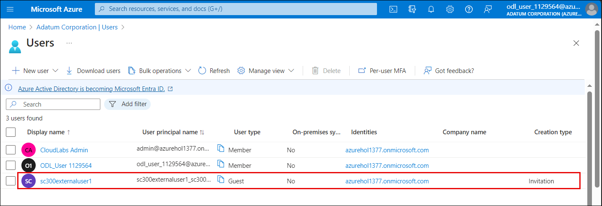
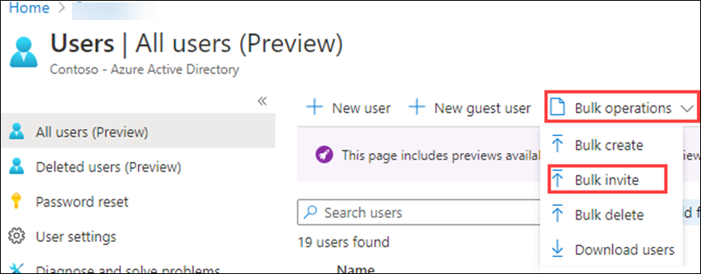
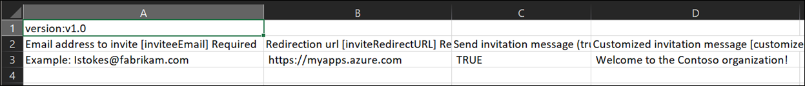
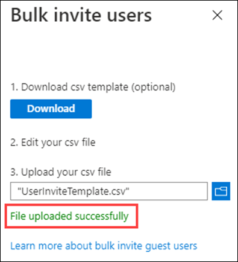

# Lab 05: Add guest users to the directory

## Lab scenario

Your company works with many vendors and, on occasion, you need to add some vendor accounts to your directory as a guest.

## Lab Objectives

After completing this lab, you will be able to:
- Add guest users to the directory
- Invite guest users in bulk

#### Estimated time: 20 minutes

### Exercise 1 - Add guest users to the directory

#### Task - Add the guest user

1. In the Azure portal, search for  and select **Microsoft Entra ID**.

2. Under **Manage**, select **Users**.

3. Select **+ New user**.

4. On the New user menu, select **Invite external user** and then add your information as the guest user.

   >**Note:** - Group email addresses are not supported; enter the email address for an individual. Also, some email providers allow users to add a plus symbol (+) and additional text to their email addresses to help with things like inbox filtering. However, Azure AD does not currently support plus symbols in email addresses. To avoid delivery issues, omit the plus symbol and any characters following it up to the @ symbol.

5. Enter an email address, such as **sc300externaluser1@sc300email.com**

6. Click on **Review + Invite** and subsequebtly click on **Invite**.

7. On the Users page, verify your account is listed and, in the **User type** column, verify **Guest** is shown.After you send the invitation, the user account is automatically added to the directory as a guest.

   

   >**Note:** Kindly click on **Refresh** from the top menu until you see the Guest user entry.
   
     > **Congratulations** on completing the task! Now, it's time to validate it. Here are the steps:
     > - Navigate to the Lab Validation Page, from the upper right corner in the lab guide section.
     > - Hit the Validate button for the corresponding task. If you receive a success message, you can proceed to the next task. 
     > - If not, carefully read the error message and retry the step, following the instructions in the lab guide.
     > - If you need any assistance, please contact us at labs-support@spektrasystems.com. We are available 24/7 to help

### Exercise 2 - Invite guest users in bulk

#### Task 1 - Bulk user invite

A recent partnership has been established with another company. For now, employees of the partner company will be added as guests. You need to ensure you can import multiple guest users at one time.

1. Navigate to **Microsoft Entra ID**.

2. Under **Manage**, select **Users**.

3. On the Users page, on the menu, select **Bulk operations > Bulk invite**.

     

4. In the Bulk invite users pane, select **Download** to a sample CSV template with invitation properties.

5. Using an editor to view the CSV file, review the template.

6. Open the .csv template and add a line for each guest user. Required values are:

    - **Email address to invite** - the user who will receive an invitation
    - **Redirection url** - the URL to which the invited user is forwarded after accepting the invitation.

    

7. Save the file.

8. On the Bulk invite users page, under **Upload your csv file**, browse to the file.

     **Note** - When you select the file, validation of the .csv file starts.

9. After the file contents are validated, you will see **File uploaded successfully**. If there are errors, you must fix them before you can submit the job.

    

10. When your file passes validation, select **Submit** to start the Azure bulk operation that adds the invitations.

11. To view the job status, select **Select here to view the status of each operation**. Or, you can select **Bulk operation results** in the Activity section. For details about each line item within the bulk operation, select the values under the **# Success**, **# Failure**, or **Total Requests** columns. If failures occurred, the reasons for failure will be listed.

     

12. When the job completes, you will see a notification that the bulk operation succeeded.

#### Task 2 - Invite guest users with PowerShell

1. Open PowerShell as an administrator.  This can be done by searching for PowerShell in Windows and choosing Run as administrator.  

1. You will need to add the Azure AD PowerShell module, if you have not used it before.  Run the command: Install-Module AzureAD.  When prompted, select “Y” to continue.

    ``` 
    Install-Module AzureAD
    ```

1. Confirm that the module installed correctly by running the command:  

    ```
    Get-Module AzureAD 
    ```

1. Next, you will need to login to Azure by running:  

    ```
    Connect-AzureAD
    ```
    
1. The Microsoft login window will appear for you to login to Azure AD.  

1. To verify that you are connected and to see existing users, run:  

    ```
    Get-AzureADUser 
    ```

1. You are ready to invite a guest user.  The following command will be populated with the user information and run.  If you have more than one user to add, you can use a notepad txt file to add the user information and copy/paste into PowerShell. 

    ```
    New-AzureADMSInvitation -InvitedUserDisplayName "Display" -InvitedUserEmailAddress name@emaildomain.com -InviteRedirectURL https://myapps.microsoft.com -SendInvitationMessage $true 
    ```

You now know how to invite users within the Azure AD portal, Microsoft 365 Admin center, Bulk invitations with a csv file, and inviting users with PowerShell commands.

## Review

In this lab you have completed the following tasks:
- Added guest users to the directory
- Invited guest users in bulk

## You have successfully completed the lab
