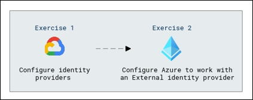
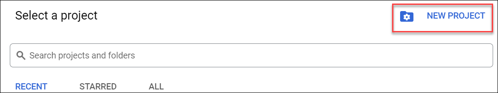
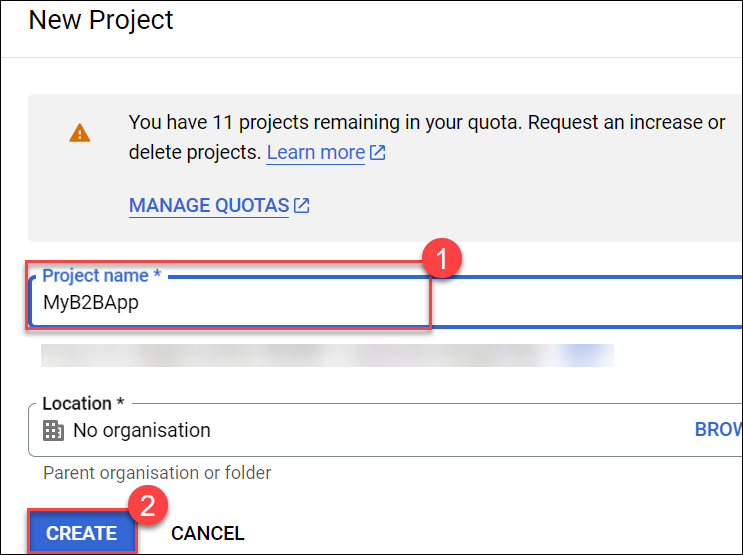
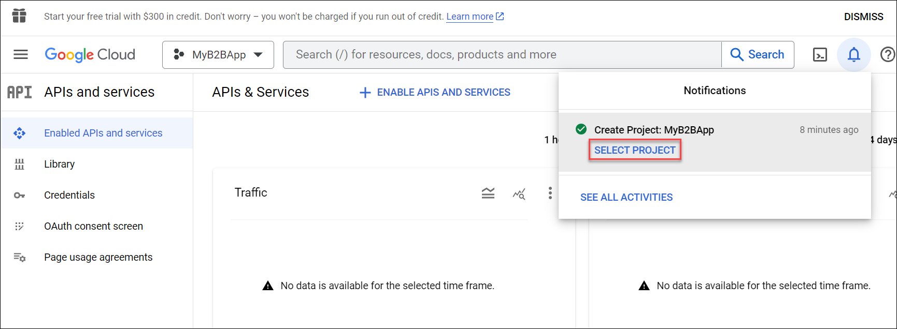
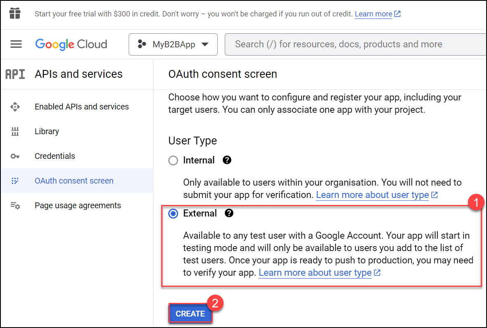
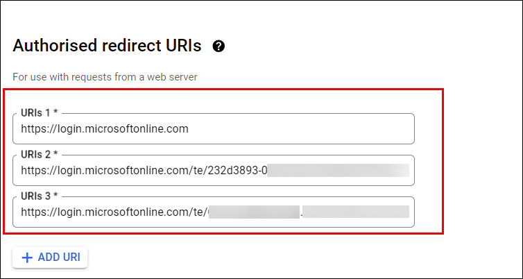
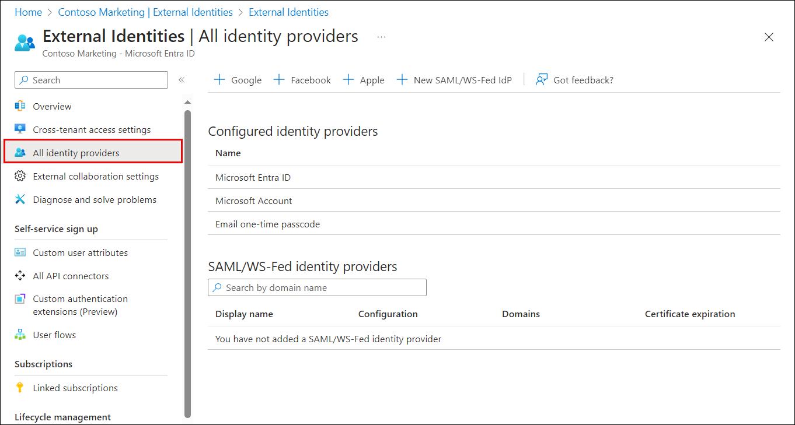
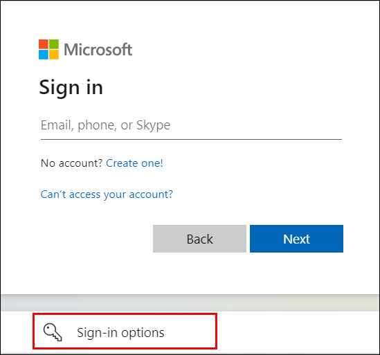
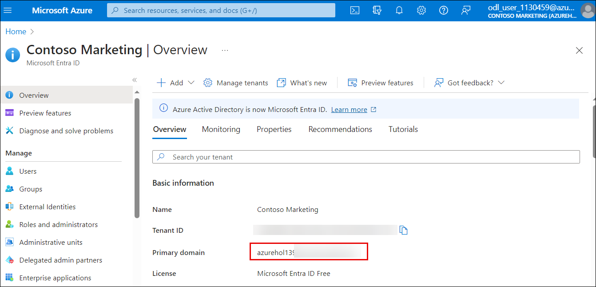

# Lab 06: Add a federated identity provider

## Lab scenario

Your company works with many vendors and, on occasion, you need to add some vendor accounts to your directory as a guest and allow them to use their Google account to sign-in.

## Lab Objectives

After completing this lab, you will be able to:
- Exercise 1 - Configure identity providers
- Exercise 2 - Configure Azure to work with an External identity provider

## Architecture Diagram



#### Estimated time: 25 minutes

### Exercise 1 - Configure identity providers

#### Task 1 - Configure Google to be used as an identity provider

**Important Note** - For this exercise, you will need a Gmail account on Google. You can use your **personnel Gmail account** or  create a **new Google account** and then follow the steps for the exercise.  Be sure to note the email address and password, they are necessary to complete the lab.

1. Open the Microsoft Edge browser and copy and paste the link to go to the Google APIs at https://console.developers.google.com, and sign in with your Google account. We recommend that you use a shared team Google account.

2. Accept the terms of service if you're prompted to do so.

3. At the top of the page, click on the dropdown next to the **select a project** menu to open the Select a project page. Choose **New Project**.  Leave the remaining fields with the default settings.

    

4. On the New Project page, give the project name **MyB2BApp (1)**, and then select **Create(2)**.

   

5. Open the new project by selecting the the **Notifications** message box or by using the project menu at the top of the page.

   

6. In the left menu, under **APIs & Services**, select **OAuth consent screen**.

7. Under User Type, select **External (1)**, and then select **Create (2)**.

   

8. On the **OAuth consent screen**, under App information, enter an App name, such as **Entra ID**.

9. Under User support email, select an email address. This should include the email address that you used to log into Google.

10. Scroll down and under Authorized domains, select **+ Add domain**, and then add the microsoftonline.com domain.

      ```
      microsoftonline.com
      ```

11. Under Developer contact information, enter the email address for the lab account that you used to sign into the portal.

12. Select **Save and continue**.

13. In the left menu, select **Credentials**.

14. Select **+ Create credentials**, and then select **OAuth client ID**.

15. In the Application type menu, select Web application. Give the application a suitable name, **Entra ID B2B**. Under **Authorized redirect URIs**, select **+ ADD URI**, and add the following URIs (select **ADD URI**, after adding each URIs):

      ```
      https://login.microsoftonline.com
      ```
      ```
      https://login.microsoftonline.com/te/**tenant ID**/oauth2/authresp
      ```
      ```
      https://login.microsoftonline.com/te/**tenant name**.onmicrosoft.com/oauth2/authresp
      ```
     
       
   
   
      >**Note:** Replace the Tenant ID and Tenant Name with the your Tenant ID and Tenant Name. Go to Azure portal and search for and select **Microsoft Entra ID** in the overview page copy the **Tenant ID** and **Tenant Name**.

16. Select **Create**. Copy your **client ID** and **client secret**. You'll use them when you add the identity provider in the Azure portal. Select **OK**.

17. You can leave your project at a publishing status of Testing.

#### Task 2 - Add a test user

1. Select the **OAuth consent screen** under APIs and Services menu.

2. Scroll down and under the **Test Users** section of the page, choose **+ ADD USERS**.

3. Enter the gmail account you created (or are using) for this lab.

4. Select **Save**.


### Exercise 2 - Configure Azure to work with an External identity provider

#### Task 1 - Configure Azure AD for Google federation
1. Navigate back to the Azure Portal.

2. Search and select for **Microsoft Entra ID**.

3. Under **Manage**, select **External Identities**.

4. Select **All identity providers** from the menu on the left.

     

5. Microsoft provides a direct federation for **Google** as an identity provider.  This can be initiated by selecting **+ Google** from the **External Identities | All identity providers** page
 
6. After selecting + Google, another page will open with additional information that is required to configure Google as an identity provider.  

7. Enter the **Client ID** and **Client secret** you obtained earlier.

8. Select **Save**.

This completes the configuration of Google as an identity provider.

#### Task 2 - Invite you Test User account

1. Open **Microsoft Entra ID**.

1. From the left-hand navigation pane, Select **Users**.

1. Select **+ New User**.

1. Select **Invite external user** from the dropdown menu.

1. Enter the information for the gmail account you set up as a test user for the Google App in Exercise 1 Task 2.

1. Enter a personal message as you want.

1. Select **Review + Invite** and subsequently click on **Invite**.

#### Task 3 - Accept the invitation and login
1. Open an InPrivate browser to log into your gmail account.

2. Open the **Microsoft Invitation on behalf of** in the Inbox.

3. Select the **Accept invitation** link in the message.

4. Enter your username and password as requested in the login dialog (if requested).

   >**NOTE** If the ferderation is working correctly, this is where you will see the first results of your new Google External Identity provider.  You will go to the login screen and be able to log in with your gmail credentials.  If the federation is not work, or has not been set up, the user would be sent and ACCOUNT VERIFICATION email after the log in, to confirm the account.  With the federation, no extra verification is needed.

   >**NOTE** If you get an access error 500, wait about 30 seconds and refresh the page.  Choose to RESUBMIT.  This error is a timing issue only in the lab environment.

5. Read over the new **Permissions requested by:** message that you get.  This message is coming from your Azure Lab Domain.

6. Choose **Accept**.

7. Once login is complete, **My Apps** page will display.

#### Task 4 - Login to Microsoft 365 using your Google account
1. Once you have finished the external user invite process of Task 3, you can log directly into Microsoft Online.

2. Open a new tab in the browser you have open.

   >**NOTE** If you did not open a new InPrivate browser in Task 3, you should do so for this step.

3. Enter the following web address:

   ```
   login.microsoftonline.com
   ```

   >**Note:** If you are already signed in with the odl user account,sign out from the top right corner.

4. Click on **Sign in** and choose **Sign in with another account** and subsequently click on **Sign-in options** on the dialog.

   
 
5. Choose **Sign in to an organization**.

6. Enter your **lab tenant domain name** in the box and select **Next**.

   >**Note:** To find the domain name, navigate to the Azure Portal where you are signed in as as the ODL user. Go to Microsoft Entra ID and from the Overview page copy the entry next to the **Primary Domain Name**.

      

7. Enter the **Google** email address and password that you created if prompted.

8. At this point, you should see your account passed to Google for confirmation; then enter the Microsoft Office portal.

## Review

In this lab you have completed the following tasks:
- Configured identity providers
- Configured Azure to work with an External identity provider

## You have successfully completed the lab

