# Lab 09 - Configure and deploy self-service password reset

## Lab scenario
The company has decided to empower the employees and enable self-service password reset. You must configure this setting in your organization.

## Lab objectives
In this lab, you will complete the following tasks:

- Task 1 - Add users to a group to assign SSPR
- Task 2 - Enable SSPR for the group
- Task 3 - Register for SSPR with Alex
- Task 4 - Test SSPR
- Task 5 - What happens if you try a user not in SSPRTesters group?

## Estimated time: 15 minutes

## Architecture diagram

### Exercise 1 - Add users to a group with SSPR enabled

#### Task 1 - Add users to a group to assign SSPR

You want to roll out SSPR to a limited set of users first to make sure your SSPR configuration works as expected. Let's create a security group for the limited rollout and add a user to the group.

1. In Azure Portal page, in Search resources, services and docs (G+/) box at the top of the portal, enter **Microsoft Entra ID**, and then select **Microsoft Entra ID** under services.

    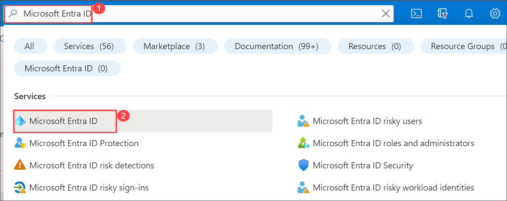

1. On the Microsoft Entra ID page, from the left-hand navigation page, under **Manage**, select **Groups**.

1. Search and select for **SSPRTesters**.

    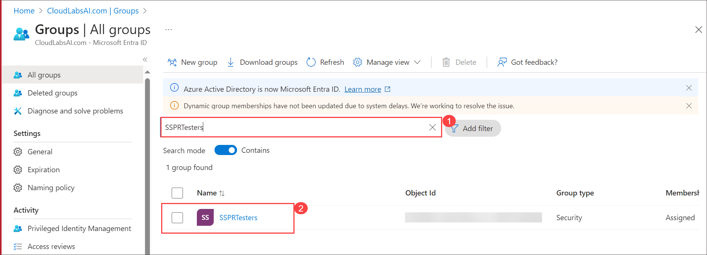

1. From the left-hand navigation pane, under **Manage** section, select **Members**. On the **SSPRTesters | Members**, select **+ Add members**.

1. On **Add members** window search and select these members **Alex Wilber**, **Allan Deyoung**, **Bianca Pisani** and check on **Select**.
   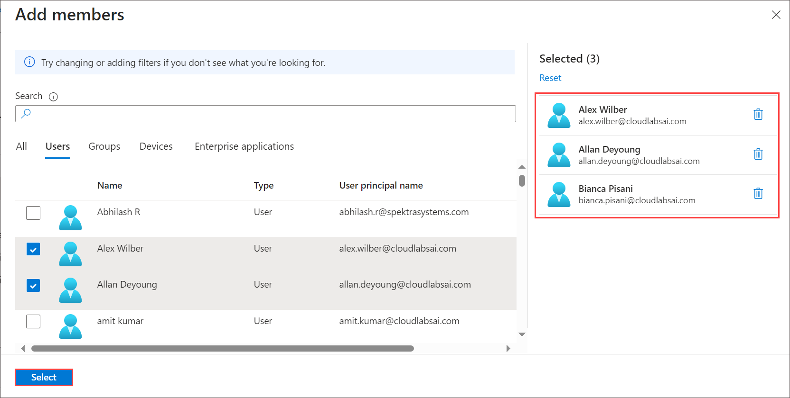

1. Back on **SSPRTesters | Members**, refresh the page and you should see all three user are list as shown in below image.

    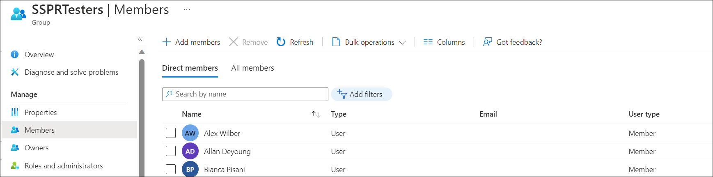

   > **Congratulations** on completing the task! Now, it's time to validate it. Here are the steps:
   > - Navigate to the Lab Validation Page, from the upper right corner in the lab guide section.
   > - Hit the Validate button for the corresponding task. You can proceed to the next task if you receive a success message.
   > - If not, carefully read the error message and retry the step, following the instructions in the lab guide.
   > - If you need any assistance, please contact us at labs-support@spektrasystems.com. We are available 24/7 to help you out.

#### Task 2 - Enable SSPR for the group

1. Browse back to the Microsoft Entra ID page.

1. Under **Manage**, select **Password reset**.

   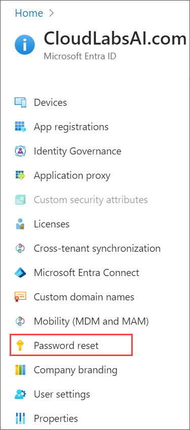

1. On the Password reset page Properties page, under **Self service password reset enabled**, review the **Selected** button is selected.

1. Skip following steps if Select group **SSPRTesters**, is already selected, if not plesae perform below step:

   - You can review in Select group **SSPRSecurityGroupUser**, is selected.

   - Click on the **SSPRSecurityGroupUser**. In the **Default password reset policy** pane, select the **SSPRTesters (2)** group.
 
   -  On the Password reset page Properties page, select **Save (3)**.

      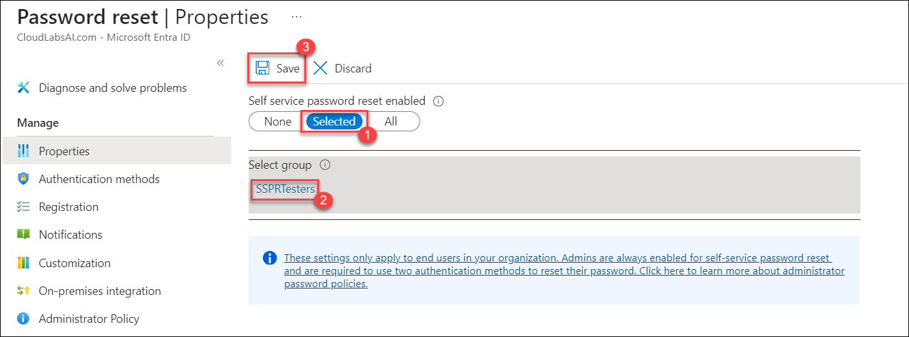

1. Under **Manage**, select and review the default values for the **Authentication methods**, **Registration**, **Notifications**, and **Customization** settings.

    >**Note** it is important to have **phone** selected as one of the authentication methods for the rest of this lab, but you can have other options as well.

#### Taks 3 - Register for SSPR with Alex

Now that the SSPR configuration is complete, register a mobile phone number for the user you created.

1. Open an InPrivate browser session and then browse to [https://aka.ms/ssprsetup](https://aka.ms/ssprsetup).

    >**Note:** This is to ensure you well be prompted for user authentication.

1. Sign in as **alex.wilber@cloudlabsai.com**, with the password = Enter the admin password of the tenant(Refer the **Environment Details** tab to retrieve the Alex's password).

    >**Note:** If prompted to update your password, enter a new password of your choice. Be sure to record the new password.

1. In the **More information required** dialog box, select **Next**.

1. On the Keep your account secure page, click on **I want to set up a different method** and from **Choose a different method** window, select **Phone** and click on **Confirm** and **Next**

     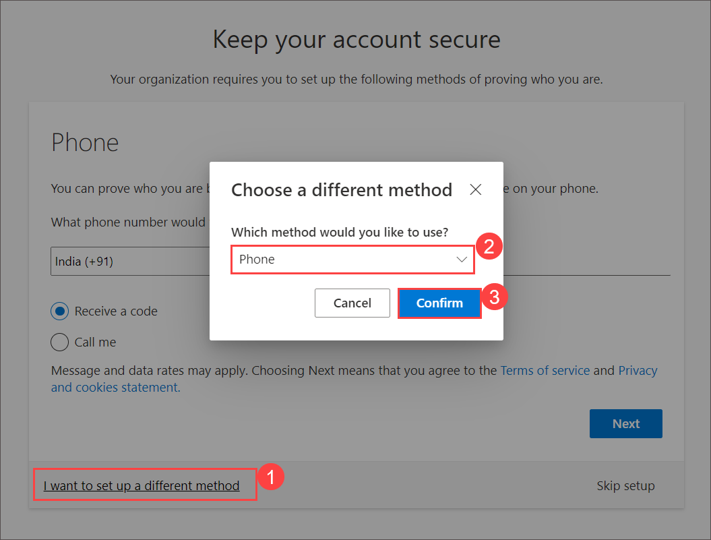

    >**Note** - In this lab, you will use the **Phone** option. Enter your mobile phone details.

1. On the Keep your account secure page, ensure **Receive a code** is selected and enter your personal cell phone number into the phone number field and select **Next**.

1. When you receive the code on your mobile phone, enter the code in the text box and then select **Next**.

1. After your phone has been registered, select **Next** and then select **Done**.

1. Close the browser. You do not need to complete the sign in process.

#### Task 4 - Test SSPR

Now let's test whether the user can reset their password.

1. Open an InPrivate browser session and then browse to [https://portal.azure.com](https://portal.azure.com).

    This is to ensure you well be prompted for user authentication.

1. Enter **alex.wilber@cloudlabsai.com**, and then select **Next**.

1. On the Enter password page, select **Forgot my password**.

   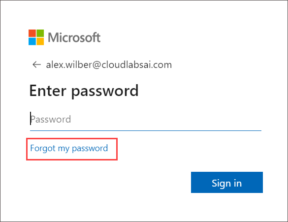

1. On the Get back into your account page, complete the requested by entering captcha and then select **Next**.

   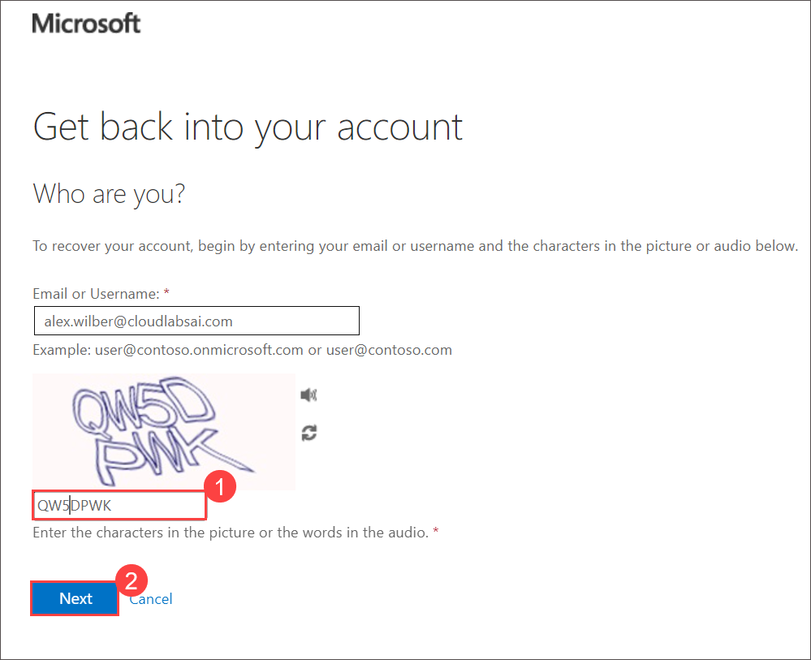

1. In the **verification step 1** task, select **Text my mobile phone (1)**, **enter your phone number (2)** and then select **Text (3)**.

   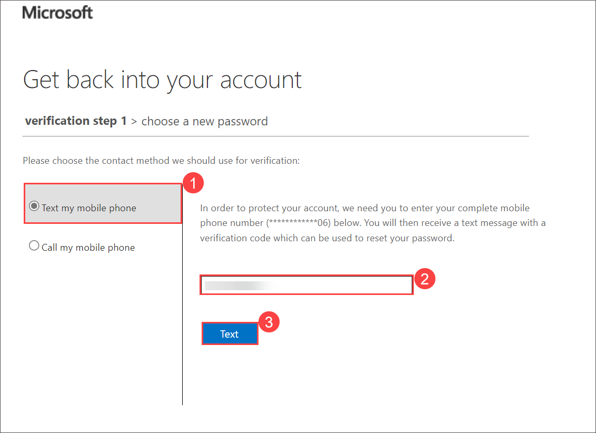

1. Enter your verification code and then select **Next**.

1. In the choose a new password step, enter and then confirm your new password. Recommend password **Pass@w.rd1234**
    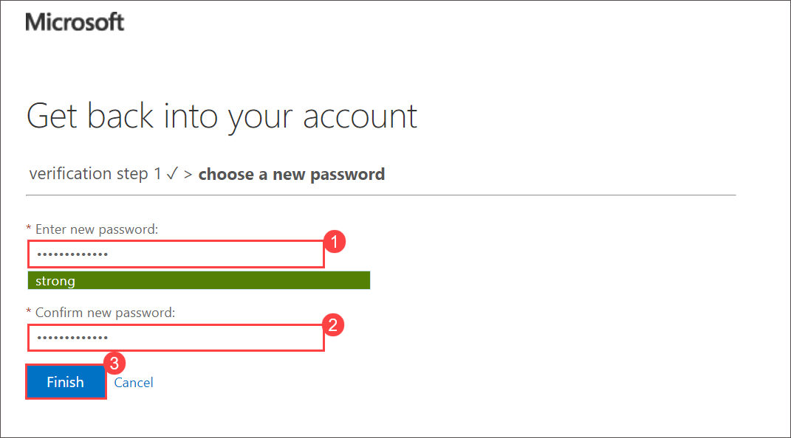

1. When complete, select **Finish**.

1. Now, browse to [https://portal.azure.com](https://portal.azure.com).

1. Sign in as **alex.wilber@cloudlabsai.com** with the new password you created.

10. Enter your verification code and then verify you can complete the sign in process.

    **Note**: If **Protect your account** window prompted please click on **Skip for now**

12. When finished, close your browser.

#### Task 5 - What happens if you try a user not in SSPRTesters group?

1. As a test, open a new InPrivate browser window, and browse to [https://portal.azure.com](https://portal.azure.com).

1. Type the username **miriam.graham@cloudlabsai.com**, and then select **Next**.
   
1. On the Enter password page, select **Forgot my password**.

1. On the Get back into your account page, complete the requested information and then select **Next**.

1. You can see the error message which states, **You can't reset your own password because password reset isn’t turned on for your account.**

    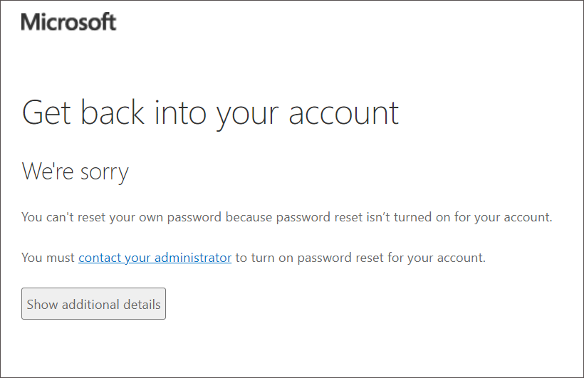

1. Close the InPrivate browser.

### Review
In this lab, you have completed:
- Added users to a group to assign SSPR
- Enabled SSPR for the group
- Registered for SSPR with Alex
- Tested SSPR
- What happens if you try a user not in the SSPRTesters group?

### You have successfully completed the lab
