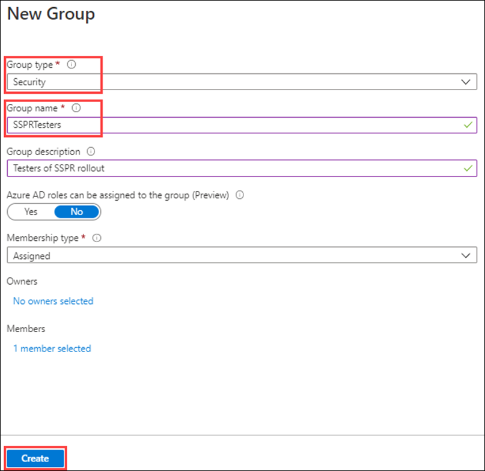
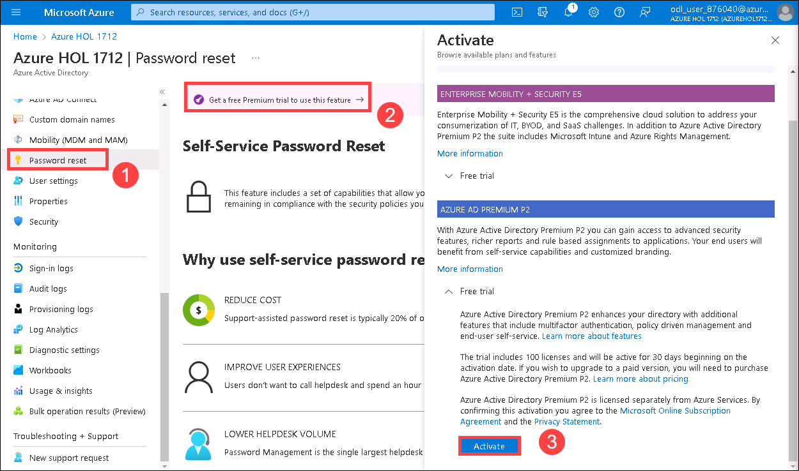
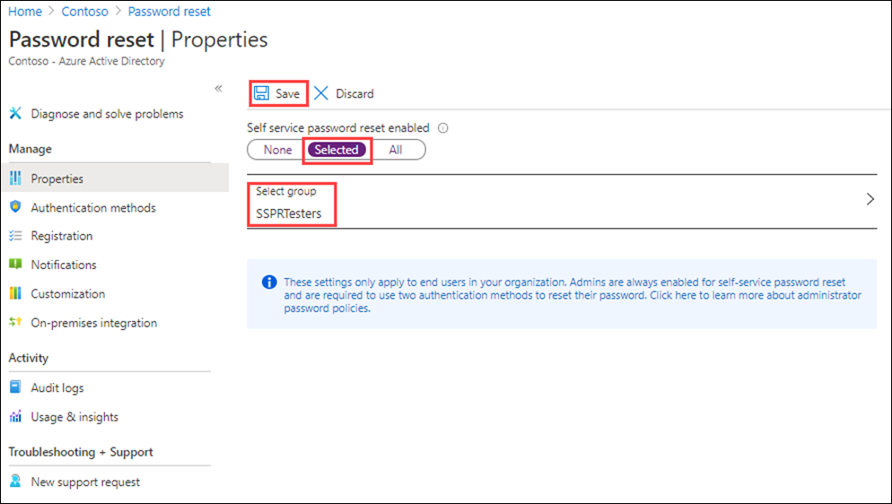
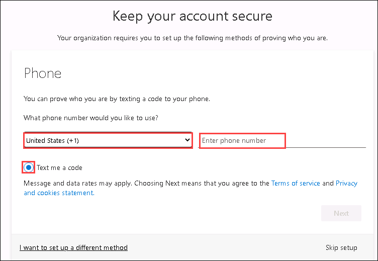
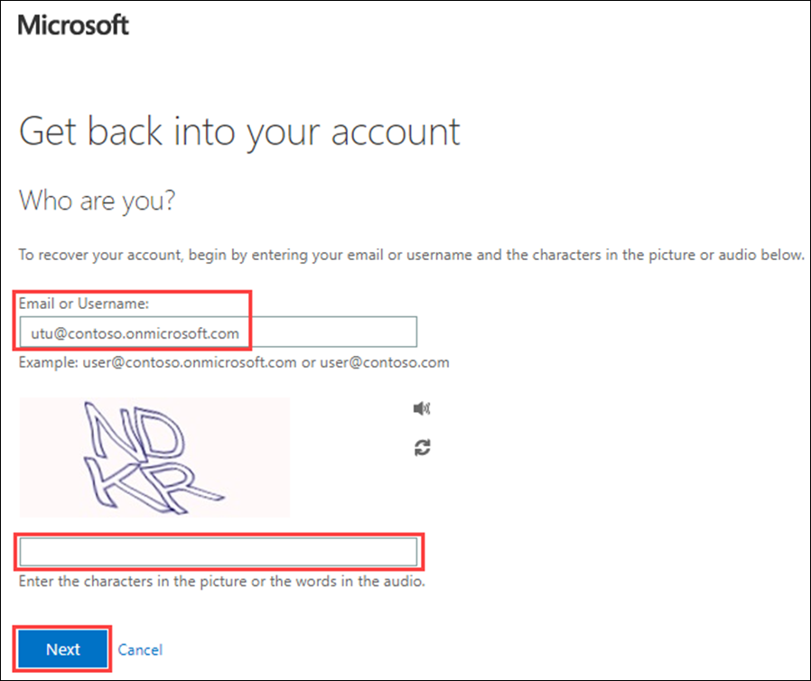
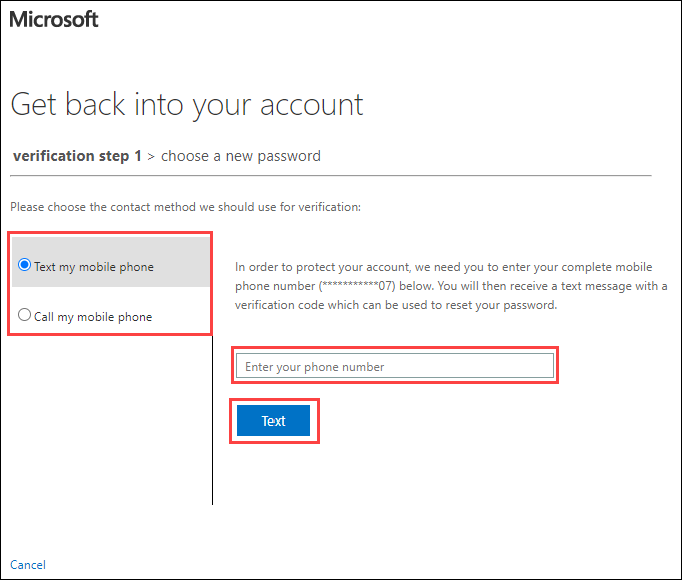

# Lab 09 - Configure and deploy self-service password reset
## Lab scenario

The company has decided to empower the employees and enable self-service password reset. You must configure this setting in your organization.

#### Estimated time: 15 minutes

### Exercise 1 - Create a group with SSPR enabled and add users to it

#### Task 1 - Create a group to assign SSPR to

You want to roll out SSPR to a limited set of users first to make sure your SSPR configuration works as expected. Let's create a security group for the limited rollout and add a user to the group.

1. On the home page of Azure portal, please search for **Azure Active Directory**.
 
2. On the Azure Active Directory page, under **Manage**, select **Groups** and select **New Group** on the right side window.

3. Create a new group using the following information:

    | **Setting**| **Value**|
    | :--- | :--- |
    | Group type| Security|
    | Group name| SSPRTesters|
    | Group description| Testers of SSPR rollout|
    | Membership type| Assigned|
    | Members| Alex Wilber |
    | |  Allan Deyoung |
    | | Bianca Pisani |
  
5. Under **Members** please click **No members selected** and in the Add members pane, please select the members mentioned in the above table.
   
6. Select **Create**.

    

#### Task 2 - Enable SSPR for you test group

Enable SSPR for the group.

1. Browse back to the Azure Active Directory page.

2. Under **Manage**, select **Password reset**.

3. Select **Get a free Premium trial to use this feature** and choose **Activate** on **Azure AD premium P2**. Wait for the trial license to be assigned and refresh your webpage before proceeding. 

    
    
4. On search bar, search for **Password reset**.    

5. On the **Password reset|Properties** pane, under **Self service password reset enabled**, select **Selected**.

6. Select **Select group**.

7. In the Default password reset policy pane, select the **SSPRTesters** group.

8. On the Password reset page Properties page, select **Save**.

    

9. Under **Manage**, select and review the default values for the **Authentication methods**, **Registration**, **Notifications**, and **Customization** settings.

    **Note** it is important to have **phone** selected as one of the authentication methods for the rest of this lab, but you can have other options as well.

#### Taks 3 - Register for SSPR with Alex

Now that the SSPR configuration is complete, register a mobile phone number for the user you created.

1. Open a different browser or open an InPrivate or Incognito browser session and then browse to [https://aka.ms/ssprsetup](https://aka.ms/ssprsetup).

    This is to ensure you well be prompted for user authentication.

2. Sign in with the following user details of Alex Wilber:

    - Username: **<inject key="User 02 UPN" enableCopy="true"/>** 
    - Password: **<inject key="User 02 Password" enableCopy="true"/>**
 
       >**Note**: The credentails of all the users can be found in the lab environment details tab.  
 
3. If prompted to update your password, enter a new password of your choice. Be sure to record the new password.

4. Select **Ask later** on **Action Required** Page. 

5. In the **More information required** dialog box, select **Next**.

6. On the **Keep your account secure** page, select you **Country Code** and **Enter your phone number** in the field. Make sure the **Text me a code** radio button is enabled.

    >**Note** - This lab uses the **Phone Aunthentication method** for verification.

    
    
9. Select **Next**.

10. When you receive the code on your mobile phone, enter the code in the text box and then select **Next**.

11. After your phone has been registered, select **Next** and then select **Done**.

12. Close the browser. You do not need to complete the sign in process.

#### Task 4 - Test SSPR

Now let's test whether the user can reset their password.

1. Open an InPrivate or Incognito browser session and then browse to [https://portal.azure.com](https://portal.azure.com).

    This is to ensure you well be prompted for user authentication.

2. Enter the username of Alex Wilber, **<inject key="User 02 UPN" enableCopy="true"/>** and then select **Next**.

3. On the Enter password page, select **Forgot my password**.

4. On the Get back into your account page, complete the requested information and then select **Next**.

    

5. In the **verification step 1** task, select **Text my mobile phone**, enter your phone number and then select **Text**.

    

6. Enter your verification code and then select **Next**.

7. In the choose a new password step, enter and then confirm your new password.  

    >**Note**: Recommended password = **Pass@w.rd1234**

8. When complete, select **Finish**.

9. Sign in as **AlexW** with the new password you created.

10. Enter your verification code and then verify you can complete the sign in process.

11. When finished, close your browser.

#### Task 5 - What happens if you try a user not in SSPRTesters group?

1. As a test, open a new InPrivate browser window and try to log into the Azure Portal as GradyA (you can find the username from the Environment details tab), and select **Forgot my password** option.
