# Lab 10 - Microsoft Entra ID Authentication for Windows and Linux Virtual Machines

## Lab scenario

The company has made the decision to implement Azure Active Directory as the authentication method for accessing virtual machines remotely. This lab will demonstrate the process of configuring this setup for both Windows and Linux virtual machines.

## Lab objectives

After completing this lab, you will be able to complete the following tasks:

- Task 1 - Login to Windows Virtual Machines in Azure with Microsoft Entra ID
- Task 2 - Microsoft Entra ID login for existing Azure Virtual Machines
- Task 3 - Update the Server VM to support the Microsoft Entra ID login
- Task 4 - Modify your RDP file to support the Microsoft Entra ID login
- Task 5 - Connect to the Windows Server 2022 Datacenter using Microsoft Entra ID login
- Task 6 - Optional testing to explore the Microsoft Entra ID login

## Estimated time: 40 minutes

## Architecture diagram

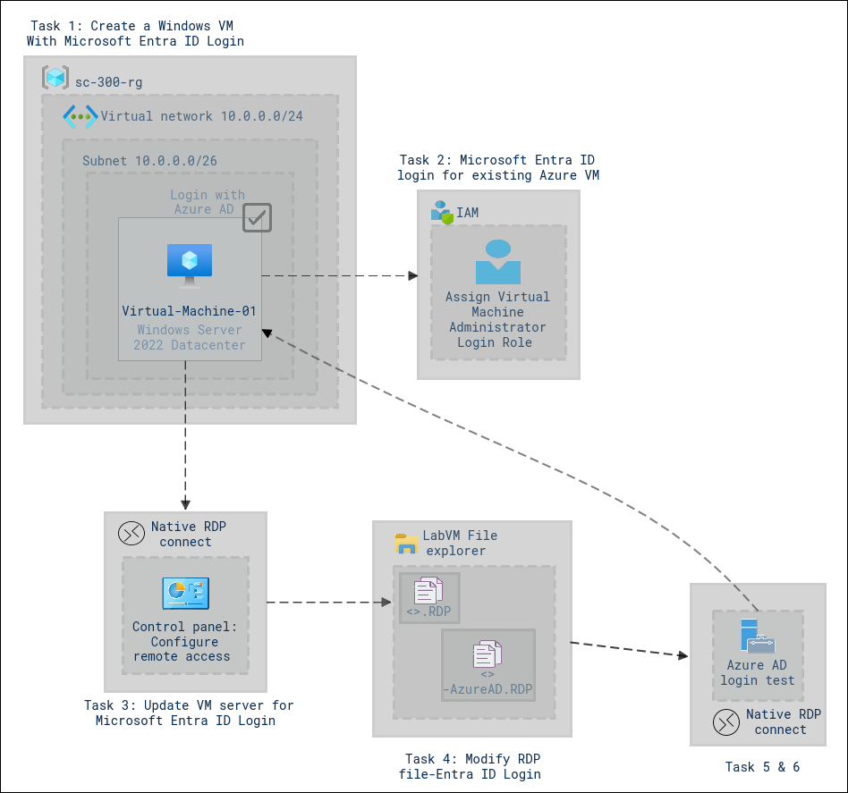

## Exercise 1: Login to Windows Virtual Machines in Azure with Microsoft Entra ID

In this exercise, you will learn how to access Windows Virtual Machines in Azure seamlessly using Microsoft Entra ID.

### Task 1: Create a Windows Virtual Machine with Microsoft Entra ID login enabled

1. In the Azure Portal, from the upper left corner select the **menu (1)** icon with three lines as highlighted below and then select **+ Create a resource (2)**.

    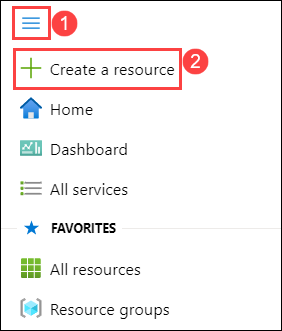

1. Type **Windows Server (1)** in Search the Marketplace search bar and then click on the **Windows Server (2)** card.

    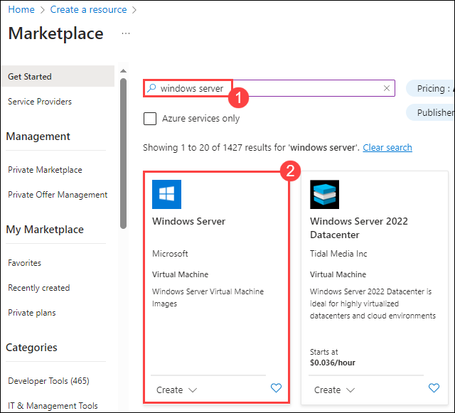

1. Ensure to choose **Windows Server 2022 Datacenter (1)** from Select a software plan dropdown and then click on **Create (2)**

    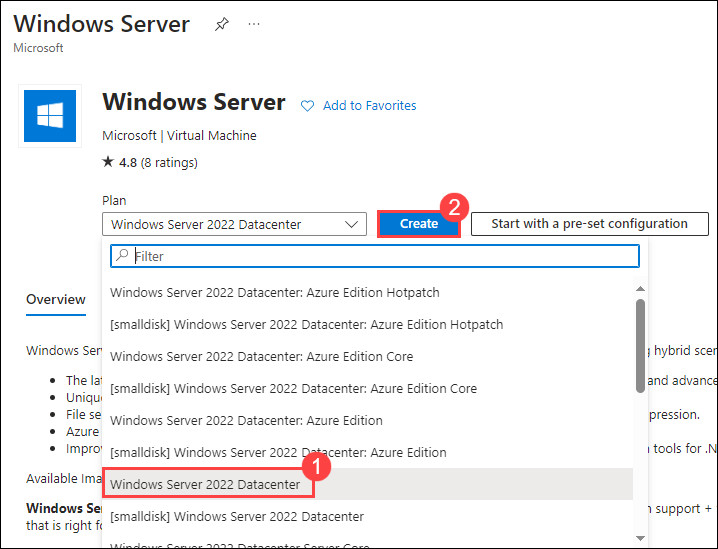

1. On the **Basics** tab of the **Create a virtual machine** page, enter the following details:

      -  **Subscription:** Select the default assigned subscription **(1)**.
      -  **Resource group:** Select **sc-300-rg** resource group from the drop-down list **(2)**.
      -  **Virtual machine name:**  Enter **Virtual-Machine-01 (3)**.
      -  **Region:** Select **<inject key="Region" enableCopy="false" /> (4)**.
      -  **Image:** Ensure to select **Windows Server 2022 Datacenter - x64 Gen2 (5)**.
      -  **Size:** Select **Standard_DS1_v2 - 1vcpu, 3.5 GiB memory (6)**.
      -  **Username:** Enter **<inject key="LabVM Admin Username" enableCopy="true" /> (7)**.
      -  **Password:** Enter **<inject key="LabVM Admin Password" enableCopy="true" /> (8)**.
      -  **Confirm password:** Re-enter **<inject key="LabVM Admin Password" enableCopy="true" /> (9)**.
      -  **Public inbound ports:** Select **Allow selected ports (10)** radio button.
      -  **Select inbound ports:** Ensure port **RDP (3389) (11)** is selected.
      -  Click on **Next Disks > (12)**
  
    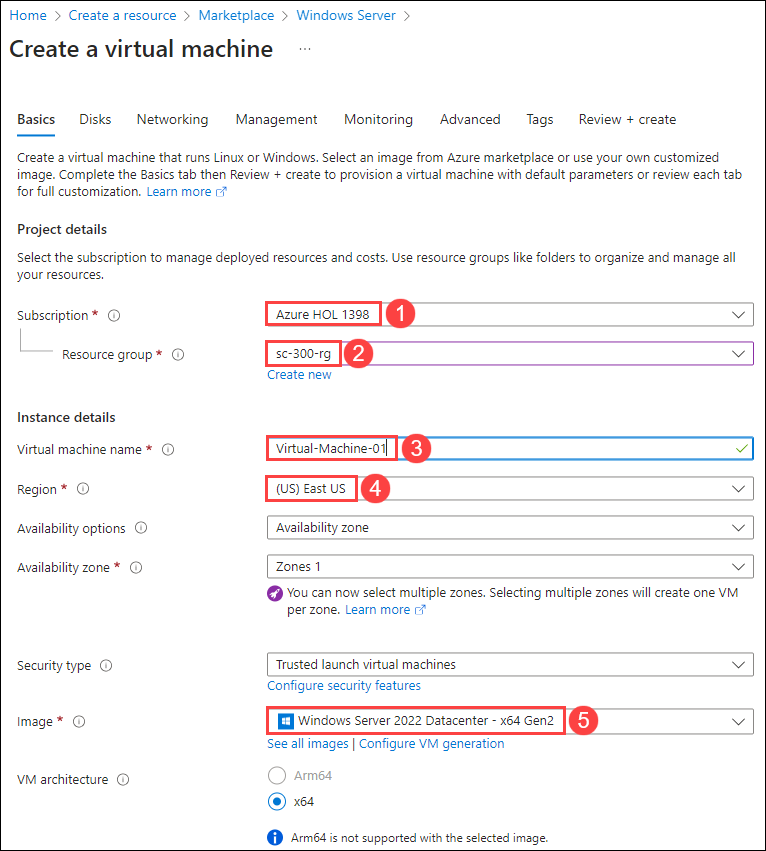
    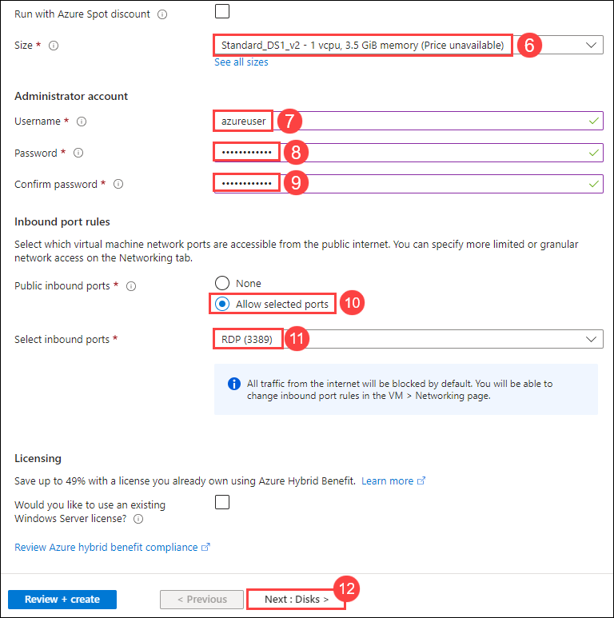

    >**Note:** Ensure to have the Username and password handy over a notepad for quick access. These credentials would be used in the late half of this lab.

1. On the **Disks** tab of the **Create a virtual machine** page, enter the following details:
   
      -  **OS disk size:** Select **Image default (127 GiB) (1)**
      -  **OS disk type:** Select **Standard SSD (locally-redundant storage) (2)**.

    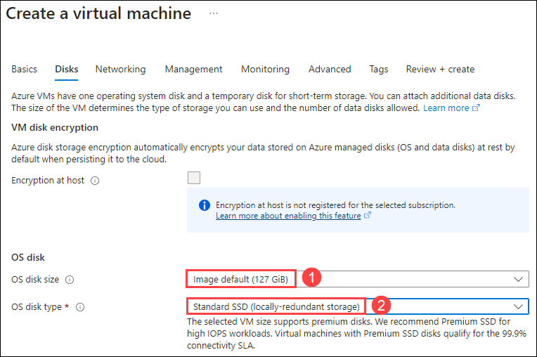

1. On the **Management (1)** tab, check the box - **Login with Azure AD (2)** under the Microsoft Entra ID section and then click on **Review + create (3)**.
   >**Note:** Notice that the **System assigned managed identity** under the Identity section is auto-matically checked and turned grey. This action should happen automatically once you enable Login with Microsoft Entra ID.

    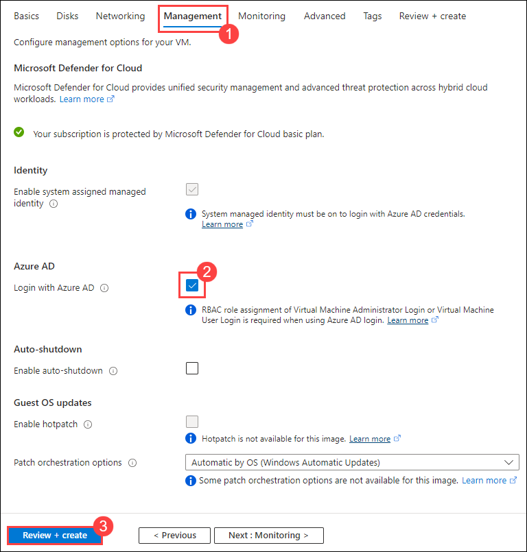

1. On the **Review + create** tab, review the virtual machine configurations and then click on the **Create** button to initiate the deployment process.
   >**Note:** The deployment of the virtual machine can take upto 3 minutes.

    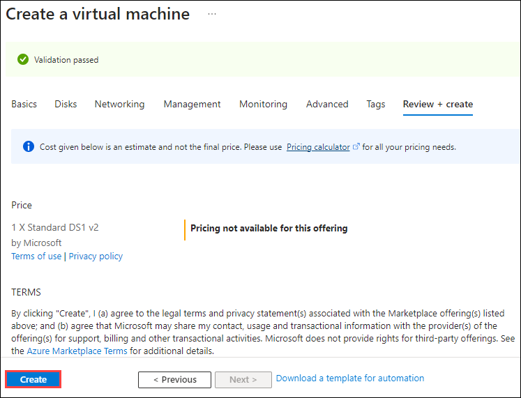

1. Once the deployment is successful, click on **Go to resource** to navigate to the overview page of the newly created virtual machine.

    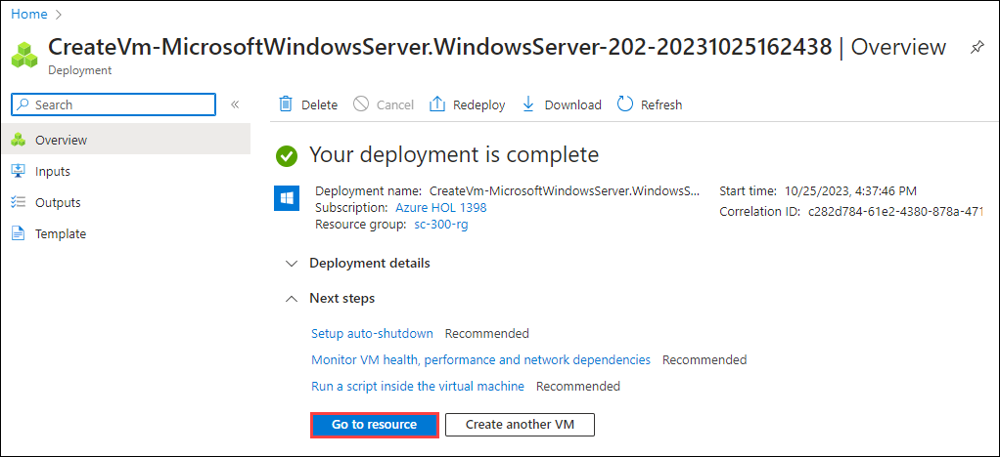

### Task 2: Microsoft Entra ID login for existing Azure Virtual Machines

1. Browse to **Virtual Machines** within the Azure portal and select the newly created Virtual Machine from Task 1.

1. In order to assign the the Virtual Machine Administrator Login role, perform the following steps:

    - Select **Access control (IAM) (1)** from the left navigation pane of the Virtual machine page.
    -  Click on **+ Add (2)**.
    -  Then select **Add role assignment (3)** from the dropdown to open the Add role assignment page.

     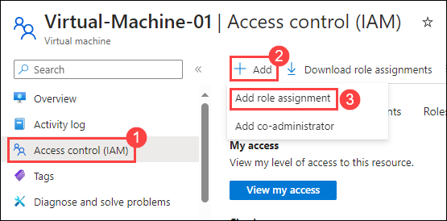

1. Within the **Role** tab of the **Add role assignment** page, assign the following settings:
    - **Assignment type**: Job function roles **(1)**
    - **Role**: Search for and select the **Virtual Machine Administrator Login (2)** function role.
    - Click on **Next (3)**. 
  
     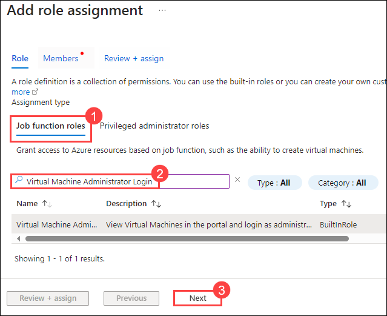

1. Onto the **Members** tab, perform the following: 
    - **Assign access to:** Choose **User, group, or service principal (1)**.
    - Then use **+ Select members (2)**.
    - Search for and add **<inject key="AzureAdUserEmail" enableCopy="true" /> (3)** as a specific user for the VM.
    - Click on **Select (4)** within the Select members pane.

     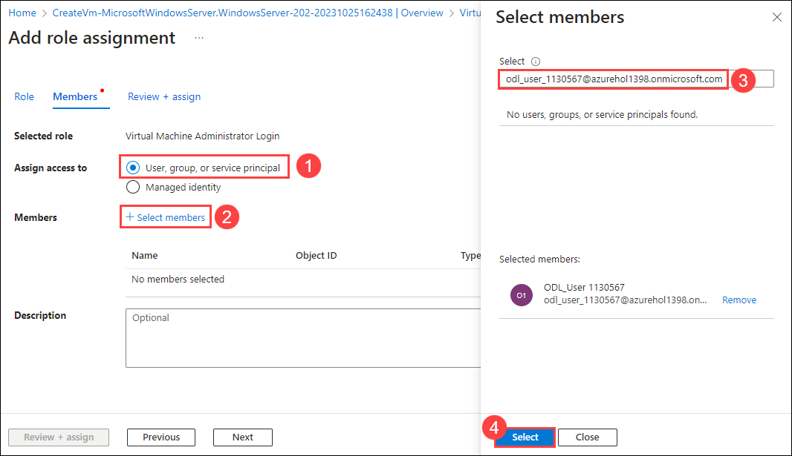

1. Once the user has been selected to assign the role, click on **Review + assign** to complete the process.

     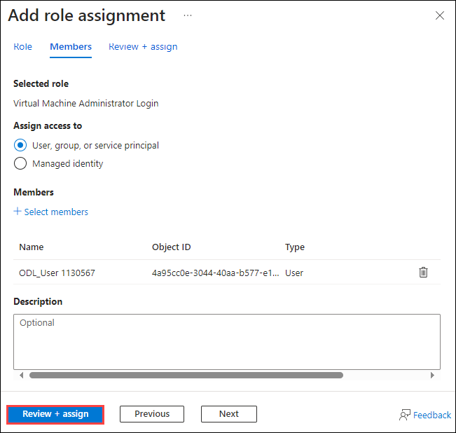

### Task 3: Update the Server VM to support the Microsoft Entra ID login

1. Browse to **Virtual Machines** within the Azure portal and select the Virtual Machine that was created in Task 1.

1. Within the Overview section, click on **Connect**.

     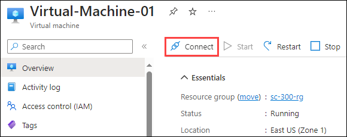

1. Click on **Select** to connect to **Virtual-Machine-01** via Native RDP.

     

1. On the **Native RDP** pane, select the **Download RDP File**.  If prompted choose the **Keep** option for the file.  It will be saved into your Downloads folder.

     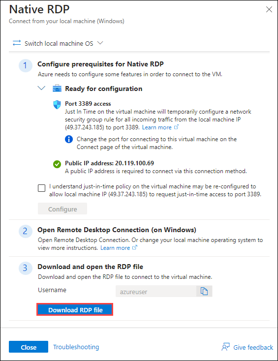

1. Open the **Downloads** folder in File Manager and click on **Connect**.

1. Open the RDP file that was downloaded and choose to log in as an Alternate User.

1. Use the Admin username and Password you create when setting up the virtual machine.
   - Admin Username: **<inject key="LabVM Admin Username" enableCopy="true" />**
   - Admin Password: **<inject key="LabVM Admin Password" enableCopy="true" />**
   - If prompted, say yes to allow access to the virtual machine or RDP session.

1. Wait for the server to initiate and all the software to load, like the Server Manager Dashboard.

   >**Note:** If you see a pop-up related to Network discovery click on **No**.

1. Select the **Start button** in the virtual machine.

1. Type **Control Panel** and launch the control panel app.

1. Select **System and Security** from the list of settings.

     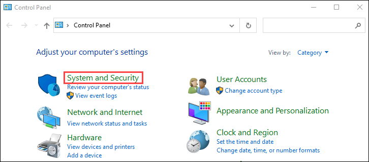

1. From the **System** setting, select the **Allow remote access** option.

     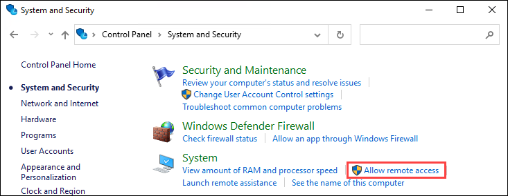

1. At the bottom of the dialog box that opens you will see a **Remote Desktop** section.
   - **Uncheck** the box labeled **Allow connections only from computers running Remote Desktop with Network Level Authentication (1)**.
   - Select **Apply (2)** and then **OK (3)**.

     

1. **Exit** the virtual machine RDP session.

### Task 4: Modify your RDP file to support the Microsoft Entra ID login

1. Open the **Downloads** folder in file manager.

1. **Make a copy** of the RDP file and add **-AzureAD** to the end of the filename as shown in the screenshot below:

     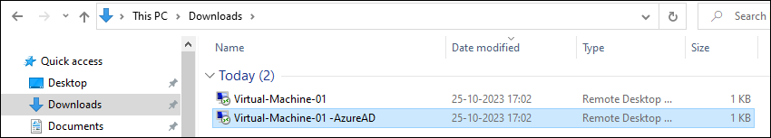

1. Edit the new version of the RDP file you just copied using Notepad.

     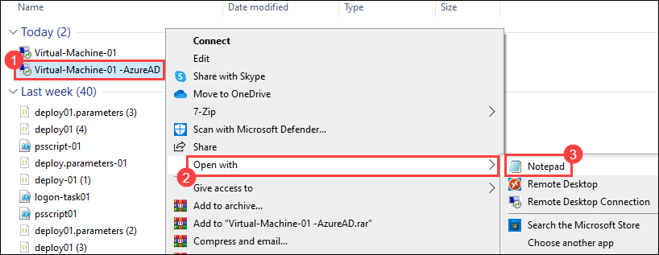

1. Add the these two lines of text to the bottom of the of the file:
     ```
        enablecredsspsupport:i:0
        authentication level:i:2
     ```

     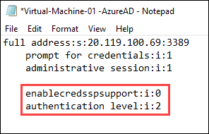
 
 1. **Save** the RDP file. You should now have two versions of the file:
      - <<virtual machine name>>.RDP
      - <<virtual machine name>>-AzureAD.RDP

### Task 5: Connect to the Windows Server 2022 Datacenter using Microsoft Entra ID login

1. Open the **Virtual-Machine-01 -AzureAD.RDP** file.

1. Select **Connect** when the dialog opens.

1. Instead of getting prompted on what User Account to log in with, you should get a message prompting on whether you want to connect to the remote computer.

1. Select **Yes**.

1. The Remote Desktop session should open; and show the Windows Server login screen with  **Other User** should be displayed.

1. In the login dialog enter the following information:
   - Username:  **<inject key="LabVM Admin Username" enableCopy="true" />**
   - Password: **<inject key="LabVM Admin Password" enableCopy="true" />** 

   >**Note:** **<inject key="LabVM Admin Username" enableCopy="false" />** is the user we granted access to log in as administrator during Task 1.

1. Windows Server should confirm the login and open to the normal Server Manager Dashboard.

### Task 6: Optional testing to explore the Microsoft Entra ID login

1. To check to see that <inject key="LabVM Admin Username" enableCopy="true" /> was the only user added to the Administrators group,
   - From the Server Manager Dashboard, select the **Tools (1)** menu from the upper right corner.
   - Launch the **Computer Management (2)** tool.

     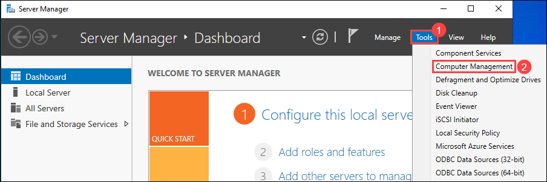

1. We can find the list of users who have been granted access to Administrator group can be found as follows :
   - Open **Local Users and Groups (1)**.
   - Navigate to **Groups (2)** and the select **Administrators (3)**.
  
     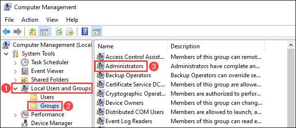

1. You should see **<inject key="LabVM Admin Username" enableCopy="false" />** in the list.

     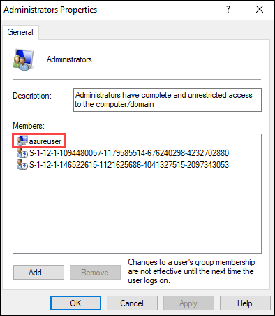

     >**Note:** It's important to highlight that other Microsoft Entra ID members are restricted from logging in using this RDP file.

## Exercise 2: Login to Linux Virtual Machines in Azure with Microsoft Entra ID [READ-ONLY]

The tasks outlined here are intended solely for informational purposes. They are meant to provide users with a better understanding and knowledge of the topic.

### Task 1: Create a Linux VM with system assigned managed identity

1. Browse to the [https://portal.azure.com](https://portal.azure.com)

1. Select **+ Create a resource**.

1. Select on **Create** under **Ubuntu Server 18.04 LTS** in the Popular view.

1. On the **Management** tab, check the box to enable **Login with Azure Active Directory (Preview)**.

1. Ensure **System assigned managed identity** is checked.

1. Go through the rest of the experience of creating a virtual machine. During this preview, you’ll have to create an administrator account with username and password or SSH public key.

#### Task 2: Microsoft Entra ID login for existing Azure Virtual Machines

1. Browse to **Virtual Machines** in the [https://portal.azure.com](https://portal.azure.com).

1. Select **Access control (IAM)**.

1. Select Add > Add role assignment to open the Add role assignment page.

1. Assign the following role. 
    - **Role**: Virtual Machine Administrator Login or Virtual Machine User Login
    - **Assign access to**: User, group, service principal, or managed identity

1. For detailed steps, see Assign Azure roles using the Azure portal.

## Review
In this lab, you have completed the following tasks:

- Logged in to Windows Virtual Machines in Azure with Microsoft Entra ID
- Microsoft Entra ID login for existing Azure Virtual Machines
- Updated the Server VM to support the Microsoft Entra ID login
- Modified your RDP file to support the Microsoft Entra ID login
- Connected to the Windows Server 2022 Datacenter using Microsoft Entra ID login
- Optional testing to explore the Microsoft Entra ID login

### You have successfully completed the lab
