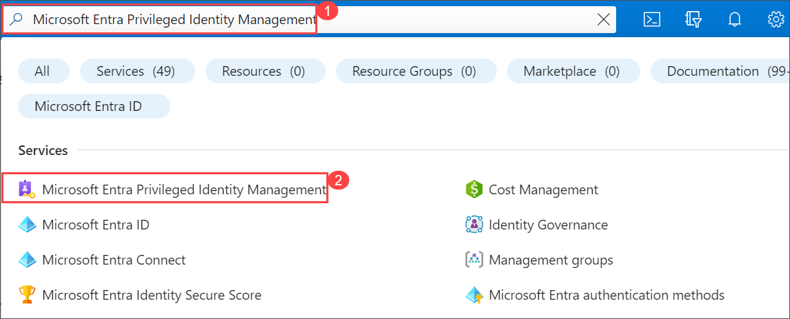
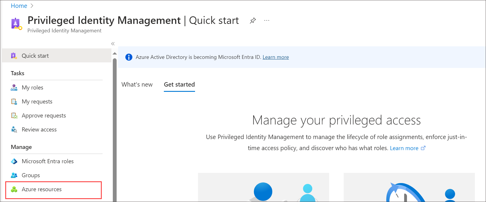
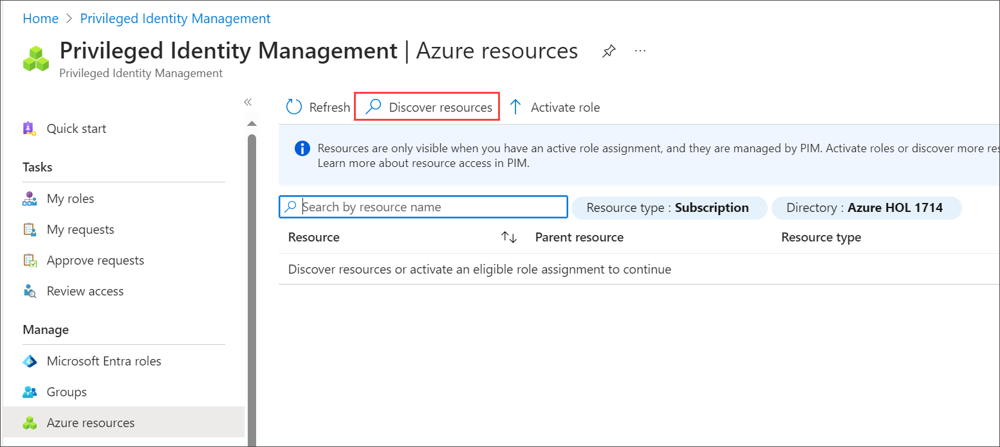
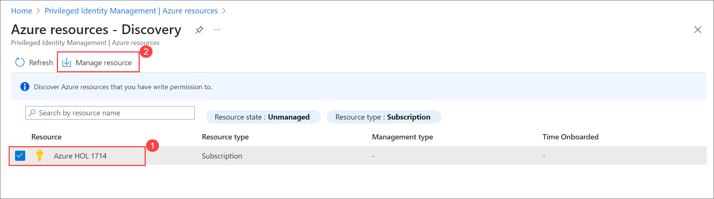
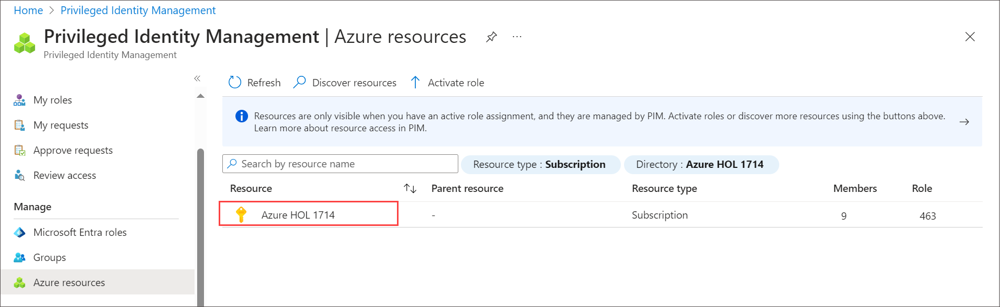
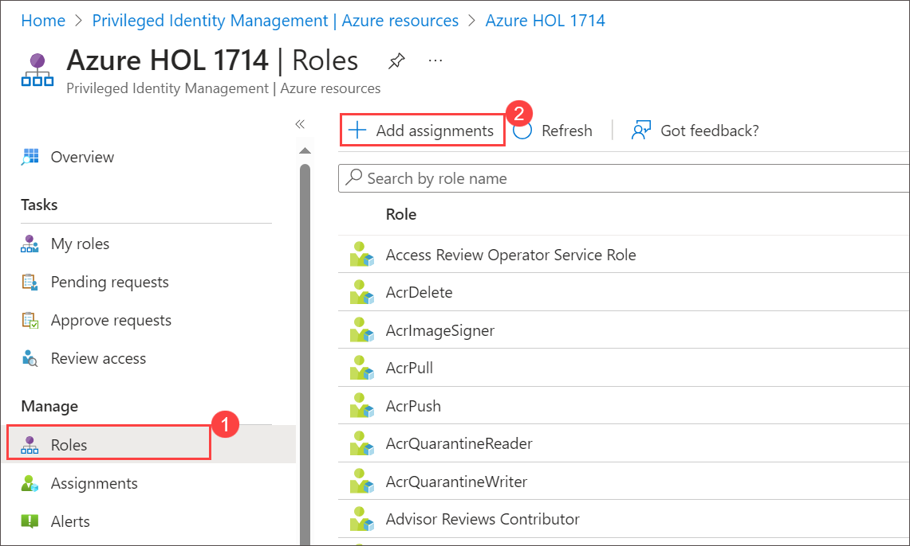
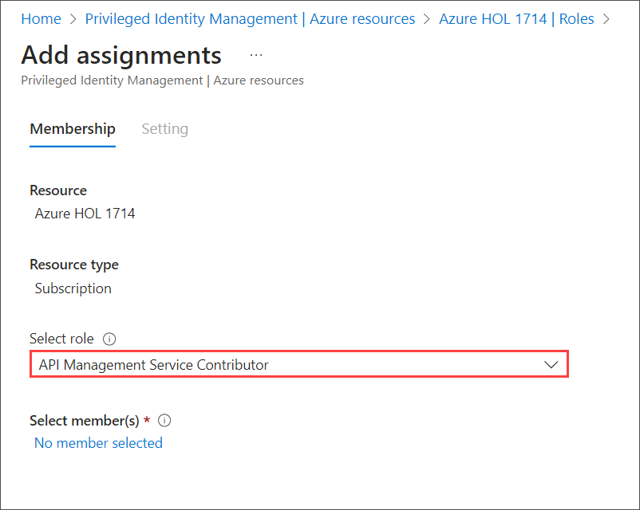
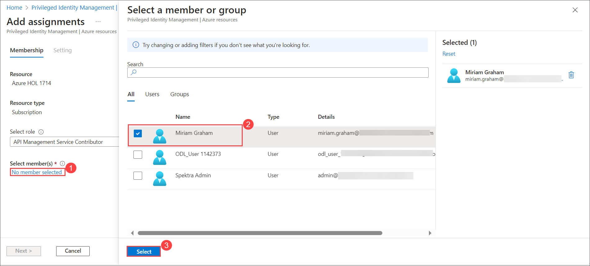
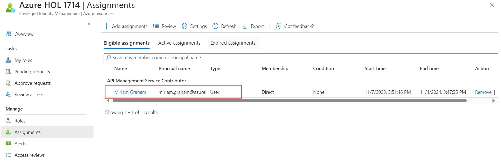
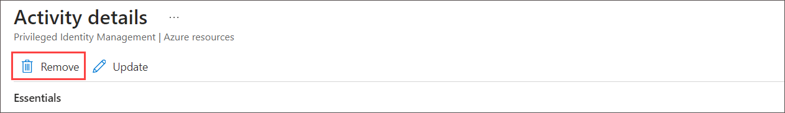

# Lab 11 - Assign Azure resource roles in Privileged Identity Management

## Lab scenario

Microsoft Entra ID Privileged Identity Management (PIM) can manage the built-in Azure resource roles, as well as custom roles, including (but not limited to):

- Owner
- User Access Administrator
- Contributor
- Security Admin
- Security Manager

You need to make a user eligible for an Azure resource role.

## Lab objectives
In this lab, you will complete the following tasks:

- Task 1 - Assign Azure resource roles
- Task 2 - Update or remove an existing resource role assignment

## Estimated time: 10 minutes

## Architecture diagram

### Exercise 1 - PIM with Azure resources

#### Task 1 - Assign Azure resource roles

1. In **Search resources, services, and docs** search for and then select **Microsoft Entra Privileged Identity Management**.

   

1. on the **Privileged Identity Management | Quick start** page, from the left-hand navigation pane, under **Manage** section, select **Azure resources (1)**.
   

1. On the top menu of **Privileged Identity Management | Azure resources** page, select **Discover resources (2)**.

   

1. In the Azure resources – Discovery page, select your **subscription (1)** and then, on the top menu, select **Manage resource (2)**.

  

1. When the **Onboarding selected resource for management** dialog box prompted, review the information and then select **OK**.

1. When onboarding completes, close the Azure resources – Discovery page.

1. Back on **Privileged Identity Management | Azure resources**, select the subscription.

   

1. From the left-hand navigation menu, under **Manage**, select **Roles** to see the list of roles for Azure resources and on the top menu, select + **Add assignments**.
   

1. In the **Add assignments** page, for the **Select role** menu and then select **API Management Service Contributor.**

   

1. Under **Select member(s),** select **No member selected** and Select **Miriam Graham** from your organization that will be assigned the role. Then chose **Select**.
    

1. Select **Next >**.

1. On the **Setting** tab, under **Assignment type**, select **Eligible**.

   - **Eligible** assignments require the member of the role to perform an action to use the role. Actions might include performing a multi-factor authentication (MFA) check, providing a business justification, or requesting approval from designated approvers.

   - **Active** assignments do not require the member to perform any action to use the role. Members assigned as active have the privileges always assigned to the role.

1. Specify an assignment duration by changing the start and end dates and times.

1. When finished, select **Assign**.

1. After the new role assignment is created, a status notification is displayed.

#### Task 2 - Update or remove an existing resource role assignment

Follow these steps to update or remove an existing role assignment.

1. Open **Microsoft Entra Privileged Identity Management**.

2. Select **Azure resources**.

3. Select the subscription you want to manage to open its overview page.

4. From the left-hand navigation pane, under **Manage**, select **Assignments**.

   

6. On the **Eligible assignments** tab, in the Action column, review the available options, and select it.

7. Select **Remove**.
   

9. In the **Remove** dialog box, review the information and then select **Yes**.

### Review
In this lab, you have completed:
- Assigned Azure resource roles
- Updated or removed an existing resource role assignment

### You have successfully completed the lab
