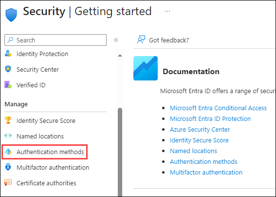
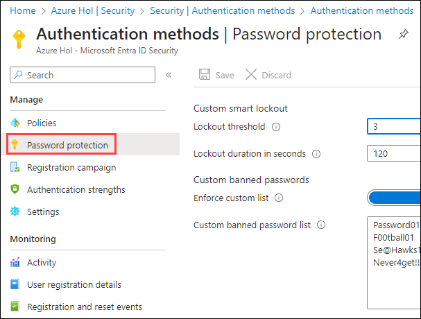
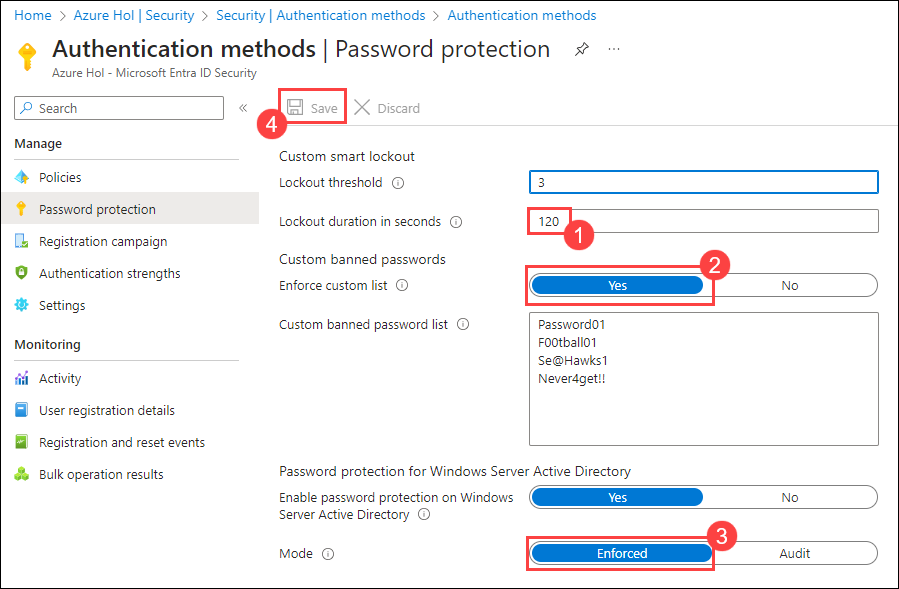

# Lab 12 - Manage Microsoft Entra ID smart lockout values

## Lab scenario

You must configure the additional password protection settings for your organization.

## Lab objectives
In this lab, you will complete the following tasks:

+ Task 1: Add Smart Lockouts

### Estimated time: 5 minutes

## Exercise 1: Manage Microsoft Entra ID smart lockout values

### Task 1: Add Smart Lockouts

Based on your organizational requirements, you can customize the Microsoft Entra ID smart lockout values. Customization of the smart lockout settings, with values specific to your organization, requires Microsoft Entra ID Premium P1 or higher licenses for your users. For the ease of lab accessibility, this laboratory scenario is provided with an active Microsoft Entra ID P1 license.

1. In Azure Portal, in **Search resources, services and docs** type **Microsoft Entra ID** and select it.

    

1. On the Microsoft Entra ID page, from the left-hand navigation page, under **Manage**, select **Security**.

    

1. On the Security page, in the left navigation, select **Authentication methods**.

    

1. On the **Authentication methods** page, within the left navigation, select **Password protection**.

    

1. In the Password protection settings, configure the following:
   - In the **Lockout duration in seconds** box, set the value to **120 (1)**.
   - **Enforce custom list:** Ensure that it has been toggeled to **Yes (2)**.
   - **Mode:** Select **Enforced (3)**
   - Save your changes **(4)**.

    

   >**Note:** When the smart lockout threshold is triggered, you will get the following message while the account is locked:
    - Your account is temporarily locked to prevent unauthorized use. Try again later, and if you still have trouble, contact your admin.

1. This can be tested by choosing a user in your Azure AD tenant, navigate in a private browser to <login.microsoftonline.com> and enter an incorrect password until the account gets notification that it is locked out.

## Review
In this lab, you have completed:
- Added Smart Lockouts.
- Understood the functionality of the Smart Lockouts.

### You have successfully completed the lab
