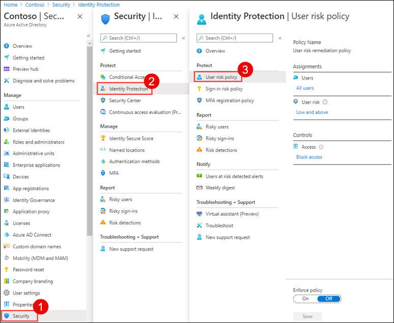

# Lab 14 - Enable sign in and user risk policies

## Lab scenario

As an additional layer of security, you need to enable and configure your Azure AD organization's sign in and user risk policies.

## Lab Objectives

After completing this lab, you will be able to:
- Task 1 - Configure the policy
- Task 2 - Enable Sign-in risk policy

#### Estimated time: 10 minutes

### Exercise 1 - Enable User risk policy

#### Task 1 - Configure the policy

1. Sign in to the [https://portal.azure.com]( https://portal.azure.com) using a Global administrator account.

2. Open the portal menu and then search for and select **Microsoft Entra ID**.

3. On the Microsoft Entra ID* page, under **Manage**, select **Security**.

4. On the Security page, in the left navigation, under **Protect** select **Identity protection**.

5. In the Identity protection page, in the left navigation, select **User risk policy**.

    

6. Under **Assignments**, select **All users** and review the available options.

7. You can select from **All users** or **Select individuals and groups** if limiting your rollout.

8. Additionally, you can choose to exclude users from the policy.

9. Under **User risk**, select **Low and above**.

10. In the User risk pane, select **High** and then select **Done**.

11. Under **Controls** > **Access**, select **Block access**.

12. In the Access pane, review the available options.

    **Tip** - Microsoft's recommendation is to Allow access and Require password change.

13. Select the **Require password change** check box and then select **Done**.

14. Under **Policy enforcement**, toggle to  **Enabled** and then select **Save**.

#### Task 2 - Enable Sign-in risk policy

1. On the Identity protection page, in the left navigation, select **Sign-in risk policy**.

2. As with the User risk policy, the Sign-in risk policy can be assigned to users and groups and allows you to exclude users from the policy.

3. Under **Sign-in risk**, select **Low and above**.

4. In the Sign-in risk pane, select **High** and then select **Done**.

5. Under **Controls** > **Access**, select **Block access**.

6. Select the **Require multi-factor authentication** check box and then select **Done**.

7. Under **Policy enforcement**,  toggle to  **Enabled** and then select **Save**.

## Review

In this lab you have completed the following tasks:

- Configured the policy
- Enabled Sign-in risk policy

## You have successfully completed the lab
