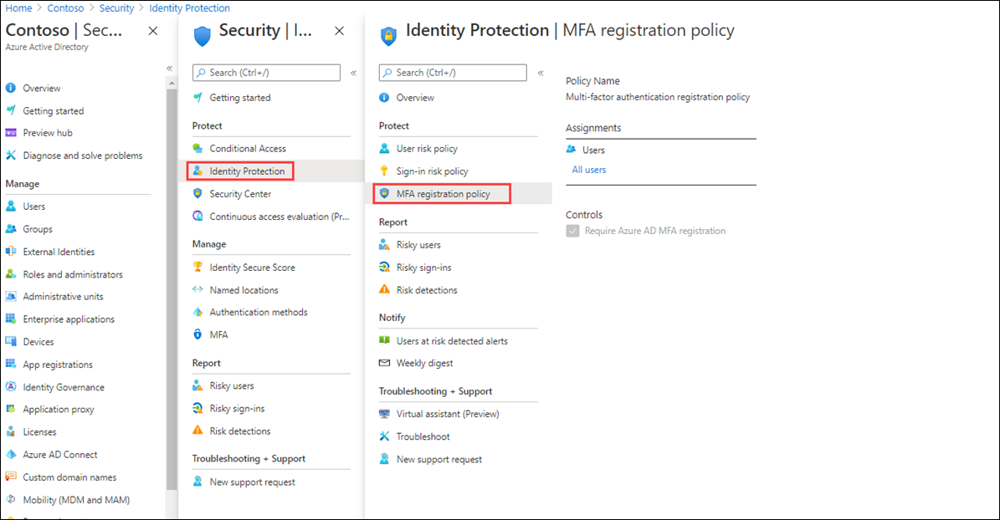
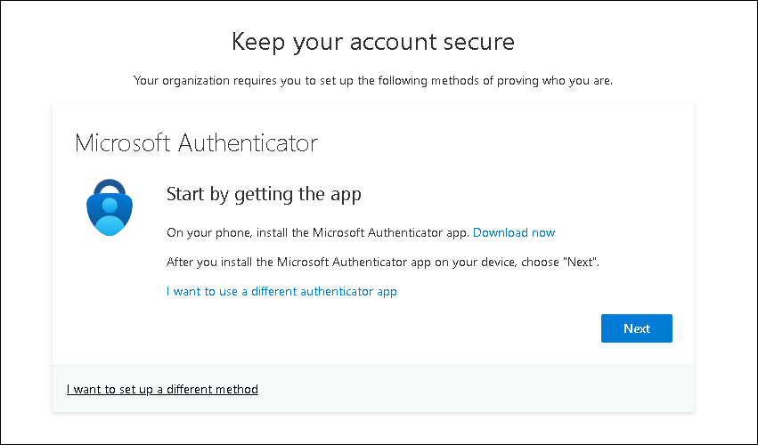

# Lab 15 - Configure an Multifactor authentication registration policy'

## Lab scenario

Multifactor authentication provides a means to verify who you are using more than just a username and password. It provides a second layer of security to user sign-ins. For users to be able to respond to MFA prompts, they must first register for Microsoft Entra Multifactor Authentication. You must configure your Microsoft Entra organization's MFA registration policy to be assigned to all users.

## Lab Objectives

After completing this lab, you will be able to:
- Task 1 - Complete Policy configuration
- Task 2 - Configure Azure AD Identity Protection policy for MFA registration

## Architecture Diagram

## Estimated time: 10 minutes

### Exercise 1 - Set up MFA registration policy

#### Task 1 - Policy configuration

1. Sign in to the [https://portal.azure.com]( https://portal.azure.com) using a Global administrator account.

2. Open the portal menu and then search for and select **Microsoft Entra ID**.

3. On the  Microsoft Entra ID page, under **Manage**, select **Security**.

4. On the Security page, in the left navigation, select **Identity protection**.

5. In the Identity protection page, in the left navigation under **Protect**, select **Multifactor authentication registration policy**.

    

6. Under **Assignments**

7. Under **Assignments**, select **All users** and review the available options.

8. You can select from **All users** or **Select individuals and groups** if limiting your rollout.

9. Additionally, you can choose to exclude users from the policy.

10. Under **Controls**, notice that the **Require Microsoft Entra ID multifactor authentication registration** is selected and cannot be changed.

#### Task 2 - Configure Microsoft Entra Identity Protection policy for MFA registration

**Note**: Microsoft Entra ID Identity Protection requires a Microsoft Entra ID Premium P2 license to be activated. 

Now let us enable MFA registration for a single user.

1. In the Azure portal, navigate to **Microsoft Entra ID Identity Protection** in the search bar.

1. Under **Protect** in the menu, select **Multifactor authentication registration policy**.

1. Under **Assignments**, select **All users** under Users, and in the Include tab, select **Select individuals and groups**

1. Now, select the user named **Chris Green** and click on **Select**.

1. Ensure that  **Policy enforcement** is toggled to **Enabled** 

1. Select **Save**.

1. This will require the user to complete the MFA registration the next time they attempt to login.

1. From a private browser, navigate to `https://login.microsoftonline.com`. Enter a user name and password from the tenant.  Note the additional security information requirements that the user is asked to enter.

    

## Review

In this lab you have completed the following tasks:
- Completed Policy configuration
- Configured Azure AD Identity Protection policy for MFA registration

## You have successfully completed the lab

