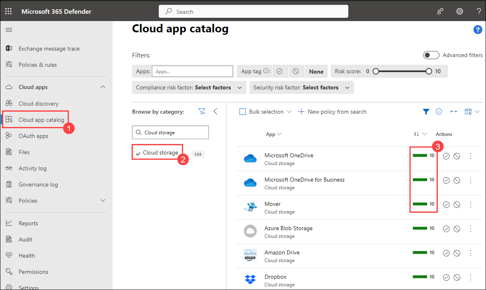
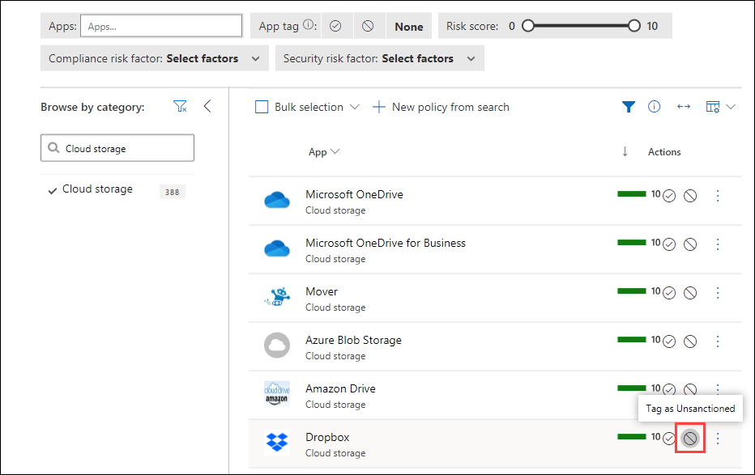

# Lab 17 - Defender for Cloud Apps application discovery and enforcing restrictions

## Lab scenario

Microsoft Defender for Cloud Apps utilizes logs from network traffic to identify the applications that users are accessing.  Traffic logs from on-premises firewalls will provide a snapshot report on the most common applications and the users that are accessing these apps.  Traffic from managed devices will be fed into the Microsoft Defender for Cloud Apps discovery overview dashboard

## Lab objectives
In this lab, you will complete the following tasks:

+ Task 1: Discovery apps in Defender for Cloud Apps
+ Task 2: Restrict Apps in Defender for Cloud Apps

### Estimated time: 20 minutes

## Architecture diagram

## Exercise 1: Defender for Cloud Apps discovery

### Task 1: Discovery apps in Defender for Cloud Apps

1. Sign in to [https://security.microsoft.com](https://security.microsoft.com) using a Global Administrator account.
    - The following credentials provided has the required Global Administrator role. These credentials can also be found in the Environment details tab.
    - Email/Username: <inject key="AzureAdUserEmail"></inject>
    - Password: <inject key="AzureAdUserPassword"></inject>

1. To understand the functionality of the Cloud app catalog, execute the following steps:
    - On the left menu, scroll to the heading named **Cloud Apps** and click **Cloud App Catalog (1)**.
    - In **Browse by category** pane, search for and select **Cloud storage (2)**.
    - In the list of apps, note the **Risk scores (3)** next to the app name.  

    

1. Open another browser tab and navigate to **Dropbox.com**.

1. Notice that you will be able to access this website.

### Task 2: Restrict Apps in Defender for Cloud Apps

1. Return to the **Discovered apps** tile and select the **Tag as unsanctioned** for Dropbox.

    

    >**Note:** This is located next to the circled check-mark.

1. This process allows you to block applications that are not sanctioned within your company policy, limiting Shadow IT within your organization.

    >**Note**: There is a delay between unsanctioning an application and that application being blocked.

Once the application has been blocked as unsanctioned, the application will not be accessible through browser, in-private browser, or store download on a Client that is onboarded to MDE (Microsoft Defender for Endpoint) integrated with Microsoft Defender for Cloud Apps.

    > **Congratulations** on completing the task! Now, it's time to validate it. Here are the steps:
    > - Navigate to the Lab Validation Page, from the upper right corner in the lab guide section.
    > - Hit the Validate button for the corresponding task. If you receive a success message, you can proceed to the next task. 
    > - If not, carefully read the error message and retry the step, following the instructions in the lab guide.
    > - If you need any assistance, please contact us at labs-support@spektrasystems.com. We are available 24/7 to help you out.

## Review
In this lab, you have completed:
- Exploring and discovery of defender for cloud apps
- Restrict Apps in Defender for Cloud Apps

### You have successfully completed the lab
