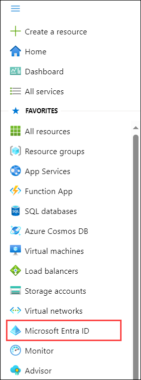
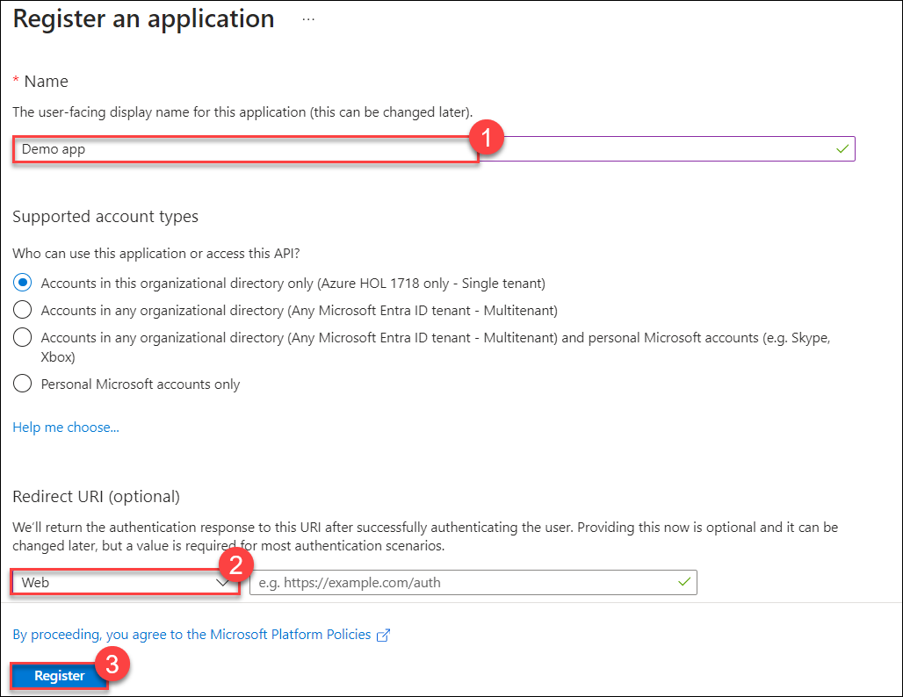
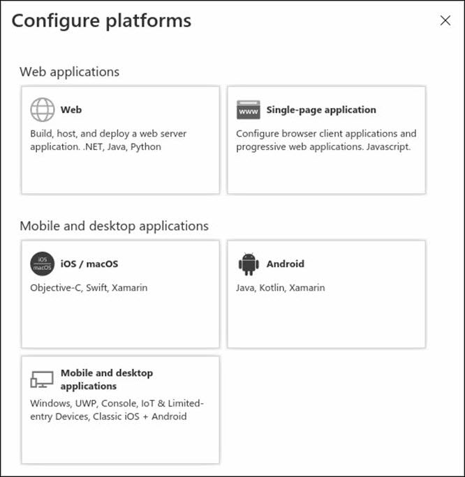
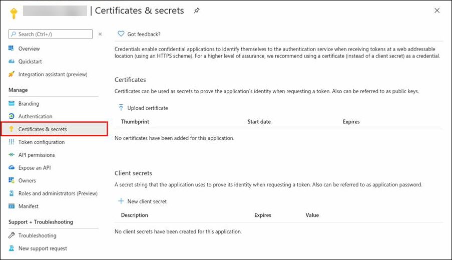
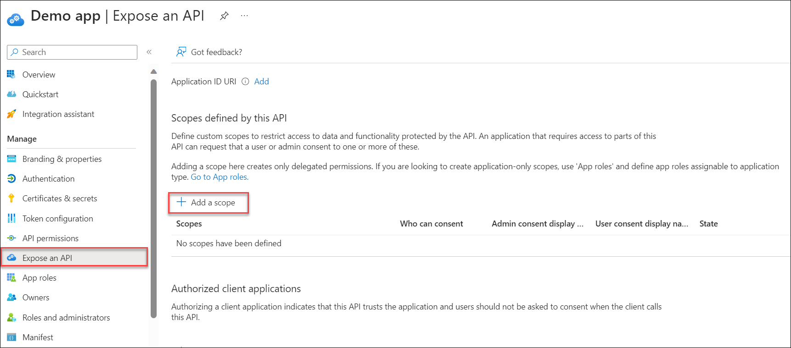
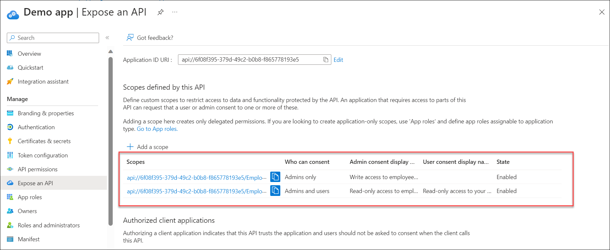
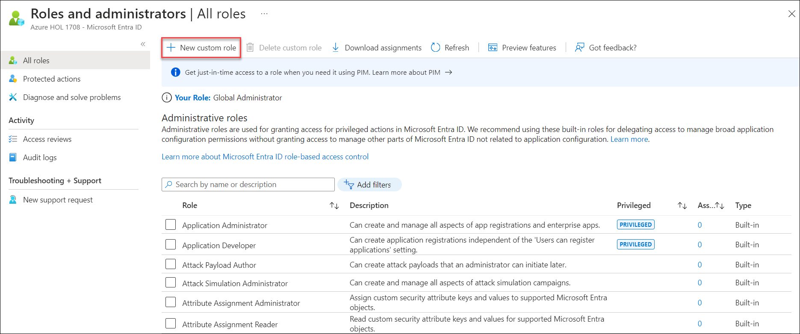
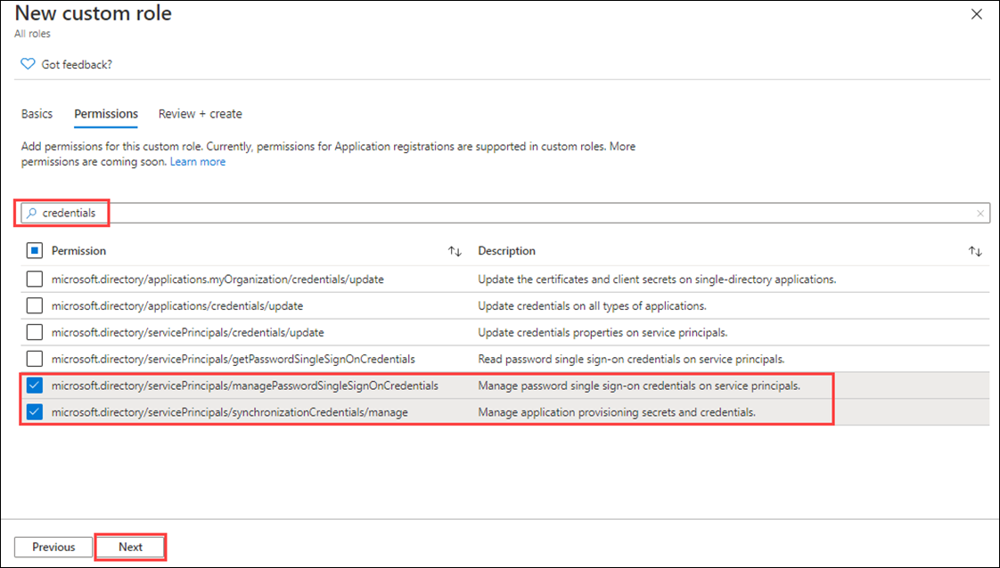

# Lab 19 - Register an application

## Lab objectives

In this lab, you will complete the following tasks:

+ Task 1 - Register an application
+ Task 2 - Manage app registration with a custom role

## Architecture Diagram

## Estimated time: 30 minutes

### Exercise 1 - Register an application

#### Task 1 - App registration

Registering your application establishes a trust relationship between your app and the Microsoft identity platform. The trust is unidirectional: Your app trusts the Microsoft identity platform—not the other way around.

1. Select the **Show portal menu** hamburger icon and then select **Microsoft Entra ID**.

    

1. On the **Microsoft Entra ID** blade, under **Manage**, select **App registrations.**

1. On the **App registrations** page, on the menu, select **+ New registration**.

1. On the **register an application** blade, register an app named **Demo app (1)** using the default values. Under **Redirect URI**, select **Web (2)**, and rest you do not need to enter the redirect URI, select **Register (3)**.

    

1. When complete, you will be directed to the **Demo app** blade.

    > **Congratulations** on completing the task! Now, it's time to validate it. Here are the steps:
   > - Navigate to the Lab Validation Page, from the upper right corner in the lab guide section.
   > - Hit the Validate button for the corresponding task. If you receive a success message, you can proceed to the next task. 
   > - If not, carefully read the error message and retry the step, following the instructions in the lab guide.
   > - If you need any assistance, please contact us at labs-support@spektrasystems.com. We are available 24/7 to help you out.

#### Task 2 - Configure platform settings

Settings for each application type, including redirect URIs, are configured in **Platform configurations** in the Azure portal. Some platforms, like **Web** and **Single-page applications**, require you to manually specify a redirect URI. For other platforms, like mobile and desktop, you can select from redirect URIs generated for you when you configure their other settings.

To configure application settings based on the platform or device you're targeting:

- Add and modify redirect URIs for your registered applications by configuring their platform settings.

1. On the **Demo app** page.

2. From the left-hand navigation pane, under **Manage**, select **Authentication**.

3. Under **Platform configurations**, select **+ Add a platform**.

4. In **Configure platforms**, select the **Mobile and desktop applications** tile, and select **[https://login.microsoftonline.com/common/oauth2/nativeclient](https://login.microsoftonline.com/common/oauth2/nativeclient)**.

    

5. Select **Configure** to complete the platform configuration.

#### Task 3 - Add credentials, certificate and client secret

Credentials are used by confidential client applications that access a web API. Examples of confidential clients include web apps, other web APIs, and service-type and daemon-type applications. Credentials allow your application to authenticate as itself, requiring no interaction from a user at runtime.

You can add both certificates and client secrets (a string) as credentials to your confidential client app registration.

>**Note**: Sometimes called a *public key*, certificates are the recommended credential type, because as they provide a higher level of assurance than a client secret. When using a trusted public certificate, you can add the certificate using the Certificates & secrets feature. Your certificate must be one of the following file types: .cer, .pem, .crt.

>**Note**: The client secret, also known as an *application password*, is a string value your app can use in place of a certificate to identity itself. It's the easier of the two credential types to use. It's often used during development, but is considered less secure than a certificate. You should use certificates in your applications running in production.

1. From the left-hand navigation pane, select **Certificates & secrets**, then select **+ New client secret**.

    

1. Under **Description**, add a description for your client secret.

1. Under **Expires**, select a duration.

1. Select **Add**.

1. **Save the value and secret ID in notepad** for use in your client application code. The Client secrets page will display the new secret value. It's important that you copy this value as it's only shown this one time. If you refresh your page and come back, it will only show as a masked value.

With your web API registered, you're ready to add the scopes that your API's code can use to provide granular permission to consumers of your API.

#### Task 5 - Add a scope

The code in a client application requests permission to perform operations defined by your web API by passing an access token along with its requests to the protected resource (the web API). Your web API then performs the requested operation only if the access token it receives contains the scopes (also known as application permissions) required for the operation.

First, follow these steps to create an example scope named Employees.Read.All:

1. Navigate back to the **Microsoft Entra ID** page.

1. From the left-hand navigation pane, select **App registrations**, select **All applications**, and then select **Demo app**.

1. From the left-hand navigation pane, under **Manage** section, select **Expose an API**, then **+ Add a scope**.

    

1. You're prompted to set an **Application ID URI**, you can use the default value provided, which is in the form api://\<application-client-id\>.

1. Select **Save and continue**.

1. Next, specify the scope's attributes in the **Add a scope** pane. For this walk-through, you can use the example values or specify your own.

    |Field|Example|
    | :--- | :--- |
    |Scope name| Employees.Read.All|
    |Who can consent| Admins and users|
    |Admin consent display name| Read-only access to employee records|
    |Admin consent description| Allow the application to have read-only access to all employee data.|
    |User consent display name|Read-only access to your employee records|
    |User consent description| Allow the application to have read-only access to your employee data.|

1. Set the **State** to **Enabled**, and then select **Add scope**.

#### Task 6 - Add a scope requiring admin consent

Next, add another example scope named Employees.Write.All that only admins can consent to. Scopes that require admin consent are typically used for providing access to higher-privileged operations, often by client applications that run as backend services or daemons that don't sign in a user interactively.

1. On the **Demo app | Expose an API**, select **+ Add a scope**.

1. To add the Employees.Write.All example scope, follow the steps above and specify these values in the **Add scope** pane:

    | Field| Example value|
    | :--- | :--- |
    | Scope name| Employees.Write.All|
    | Who can consent| Admins only|
    | Admin consent display name| Write access to employee records|
    | Admin consent description| Allow the application to have write access to all employee data.|
    | User consent display name| None (leave empty)|
    | User consent description| None (leave empty)|

    >**Note**: If you successfully added both example scopes described in the previous sections, they'll appear in the **Expose an API** pane of your web API's app registration, similar to this image:

    

As shown in the image, a scope's full string is the concatenation of your web API's **Application ID URI** and the scope's **Scope name**.

        **Note**: For example, if your web API's application ID URI is `https://contoso.com/api` and the scope name is Employees.Read.All, the full scope is: `https://contoso.com/api/Employees.Read.All`

        **Note**: Next, you will configure a client app's registration with access to your web API and the scopes you defined by following the steps above.
    
Once a client app registration is granted permission to access your web API, the client can be issued an OAuth 2.0 access token by the Microsoft identity platform. When the client calls the web API, it presents an access token whose scope (scp) claim is set to the permissions you've specified in the client's app registration. You can expose additional scopes later as necessary. Consider that your web API can expose multiple scopes associated with several operations. Your resource can control access to the web API at runtime by evaluating the scope (scp) claim(s) in the OAuth 2.0 access token it receives.

### Exercise 2 - Manage app registration with a custom role

#### Task 1 - Create a new custom role to grant access to manage app registrations

You need to create a new custom role for app management. This new role should be limited to only the specific permissions required to perform credential management.

1. Navigate back to the **Microsoft Entra ID**.

1. On the Microsoft Entra ID blade, from the left-hand navigation pane, under **Manage**, select **Roles and administrators**.

1. Select the statement which says **To create custom roles, your organization needs Microsoft Entra ID Premium P1 or P2. Start a free trial.**, and under **MICROSOFT ENTRA ID P2**, select **Free trial**, and select **Activate**.

    >**Note:** Wait for some time, to activate the license. Keep refreshing the page, until **+ New custom role** button is enabled.

1. On the Roles and administrators blade, on the menu, select **+ New custom role**.

    

1. In the New custom role blade, on the Basics tab, in the name box, enter **My custom app role**.

6. Review the remaining options and then select **Next**.

7. On the Permissions tab, review the available permissions.

8. In the **Search by permission name or description** box, enter **credentials**.

9. In the results, select the **Manage** permissions and then select **Next**.

- **microsoft.directory/servicePrincipals/managePasswordSingleSignOnCredentials**:-   Manage password single sign-on credentials or service principals.
    
- **microsoft.directory/servicePrincipals/synchronizationCredentials/manage**:-   Manage application provisioning secrets and credentials.
    

    

    > **Why pick those two** - For application provisionsing these two items are the bare minimum permissions needed to enable and enforce single sign-on for the application or service principal being created; and be able to assign the enterise application to a set of users or groups.  Other permissions could also be granted.  You can get a full list of available permissions at `https://docs.microsoft.com/azure/active-directory/roles/custom-enterprise-app-permissions`.

10. Review the changes and then select **Create**.

    > **Congratulations** on completing the task! Now, it's time to validate it. Here are the steps:
    > - Navigate to the Lab Validation Page, from the upper right corner in the lab guide section.
    > - Hit the Validate button for the corresponding task. If you receive a success message, you can proceed to the next task. 
    > - If not, carefully read the error message and retry the step, following the instructions in the lab guide.
    > - If you need any assistance, please contact us at labs-support@spektrasystems.com. We are available 24/7 to help you out.

## Review
In this lab, you have completed:
- Register an application
- Manage app registration with a custom role

## You have successfully completed the lab

