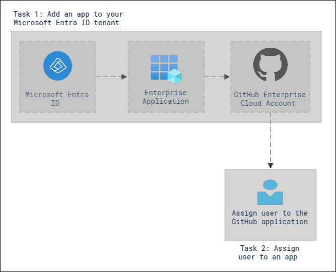
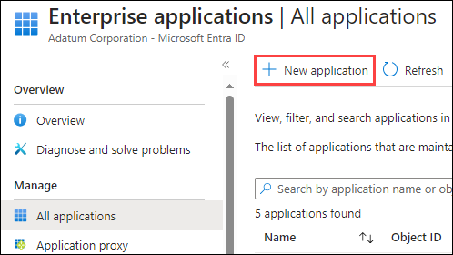
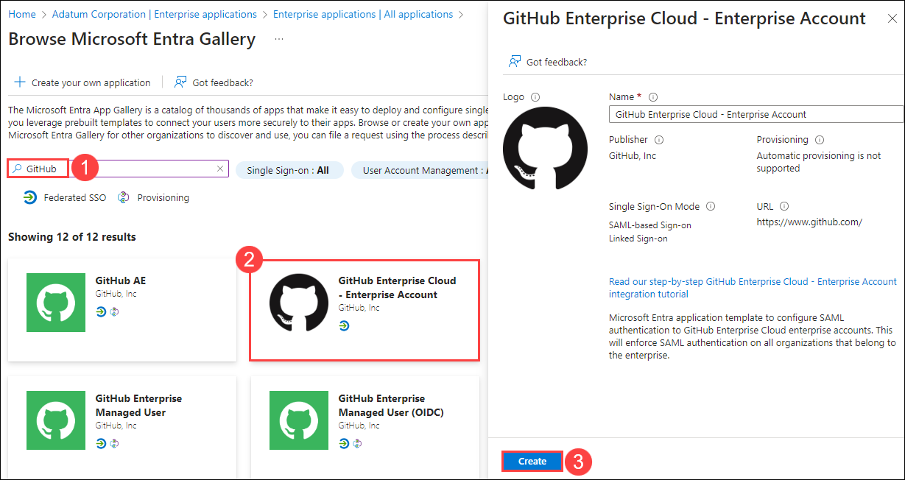
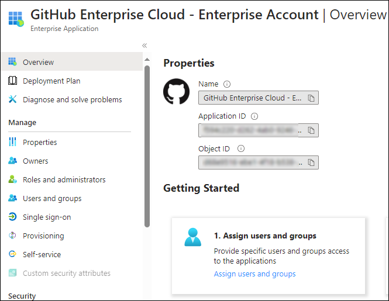
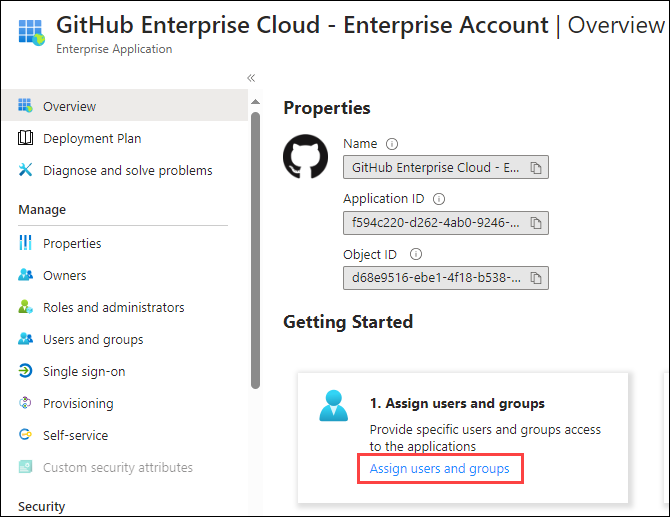
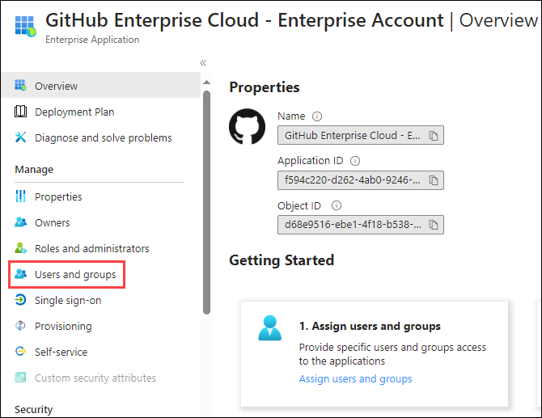
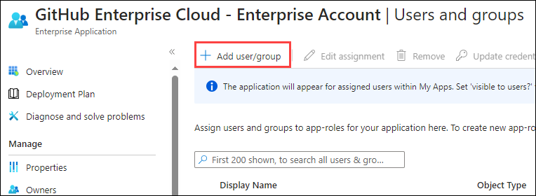
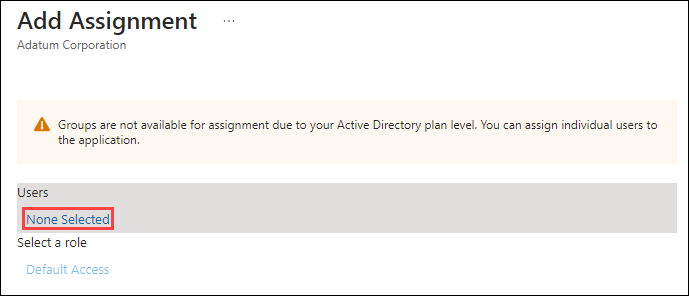
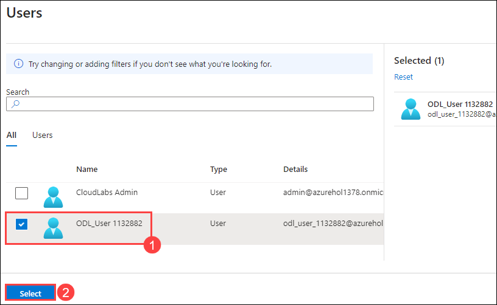
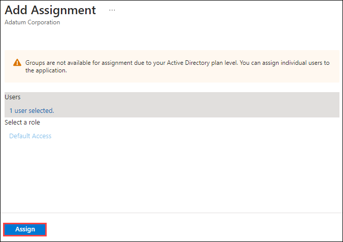

# Lab 20 - Implement access management for apps

## Lab scenario

Your organization requires that only specific users or groups have access to enterprise applications. You must assign a user to a specific application.

## Lab objectives
In this lab, you will complete the following tasks:

+ Exercise 1: Configure an Enterprise App
    + Task 1: Add an app to your Microsoft Entra ID tenant
    + Task 2: Assign users to an app

### Estimated time: 20 minutes

## Architecture diagram

## Exercise 1: Configure an Enterprise App

### Task 1: Add an app to your Microsoft Entra ID tenant

1. In Azure Portal, in **Search resources, services and docs** type **Microsoft Entra ID** and select it.

    

2. On the Microsoft Entra ID page, under **Manage**, select **Enterprise applications**.

    

3. In the Enterprise applications pane, select **+ New application**.

    

4. Perform the following steps within Browse Microsoft Entra Gallery page to create a new Enterprise Application:
    - In the **Search application** box, enter **GitHub (1)**.
    - From the list of results, select **GitHub Enterprise Cloud – Enterprise Account (2)**.
    - In the **GitHub Enterprise Cloud – Enterprise Account**, review the settings and then select **Create (3)**.

    

    >**Note:** The Enterprise Application creation may take upto 2 minutes. Please wait till the deployment is successful.

5. Once created, you will be redirected to the GitHub Enterprise Cloud – Enterprise Account page.

    

    > **Congratulations** on completing the task! Now, it's time to validate it. Here are the steps:
    > - Navigate to the Lab Validation Page, from the upper right corner in the lab guide section.
    > - Hit the Validate button for the corresponding task. If you receive a success message, you can proceed to the next task. 
    > - If not, carefully read the error message and retry the step, following the instructions in the lab guide.
    > - If you need any assistance, please contact us at labs-support@spektrasystems.com. We are available 24/7 to help you out.

### Task 2: Assign users to an app

1. On the GitHub Enterprise Cloud – Enterprise Account page, on the Overview page, under **Getting Started**, select **1. Assign users and groups**.

    

2. Alternatively, in the left navigation, under **Manage**, you can select **Users and groups**.

    

3. Within the Users and groups page, on the menu, select **+Add user/group**.

    

4. On the Add Assignment page, under **Users**, selct **None selected**.

    

5. In the Users pane, select your administrator account ie, **ODL_User <inject key="DeploymentId" enableCopy="false" /> (1)** and then select **Select (2)**.

    

6. Select **Assign** on the **Add Assignment** page.

    

    > **Congratulations** on completing the task! Now, it's time to validate it. Here are the steps:
    > - Navigate to the Lab Validation Page, from the upper right corner in the lab guide section.
    > - Hit the Validate button for the corresponding task. If you receive a success message, you can proceed to the next task. 
    > - If not, carefully read the error message and retry the step, following the instructions in the lab guide.
    > - If you need any assistance, please contact us at labs-support@spektrasystems.com. We are available 24/7 to help you out.

## Review

In this lab, you have completed:
- Adding an app to your Microsoft Entra ID tenant
- Assigning users to an app
Thus, completes the configuration process of an Enterprise Application.

### You have successfully completed the lab
