# Lab 23: Add terms of use and acceptance reporting 

## Lab scenario
Microsoft Entra terms of use policies provide a simple method that organizations can use to present information to end users. This presentation ensures users see relevant disclaimers for legal or compliance requirements. This article describes how to get started with terms of use (ToU) policies.

You must create and enforce a ToU policy for your organization.

## Lab objectives

After completing this lab, you will be able to complete the following tasks:

+ Task 1 - Add terms of use
+ Task 2 - Log in as an user
+ Task 3 - Review the report of aceptance and rejection records
+ Task 4 - What terms of use looks like for users
+ Task 5 - How users can review their terms of use
+ Task 6 - Edit terms of use details

## Estimated time: 40 minutes

## Architecture diagram

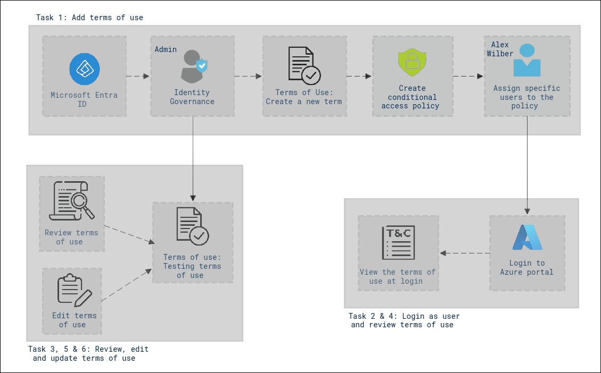

## Exercise 1: Establish a Terms of Use and Conduct Testing

In this exercise, you will learn how to use Microsoft Entra terms of use policies which is a simple method that organizations can use to present information to end users.

### Task 1: Add terms of use

Once you have finalized your terms of use document, use the following procedure to add it.

1. In Azure Portal, in **Search resources, services and docs** type **Microsoft Entra ID** and select it.

    

2. On the Microsoft Entra ID page, from the left-hand navigation page, under **Manage**, select **Identity Governance**.

    

3. To create a new term,
    - In the left navigation menu of the **Identity Governance** page, under **Terms of use**, select **Terms of use (1)**.
    - On the Terms of use page, on the top menu, select **+ New terms (2)**

      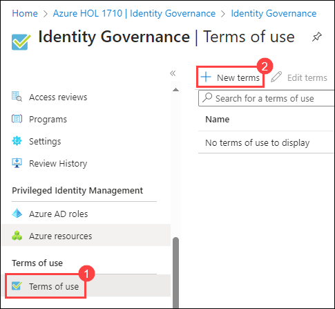

4. Within the **New terms of use** page, configure the following:
    
    - **Name:** Enter **Testing terms of use (1)**. This is the terms of use that will be used in the Azure portal.
    
    - Select the **Terms of use document box (2)**, browse to your finalized terms of use PDF and select it.

       >**Note:** **ToU File Provided** - Browse to the local file path **C:\AllFiles\SC-300-Identity-and-Access-Administrator\AllFiles\Labs\Lab26\Contoso_TermsOfuse.pdf** to get a sample Terms-of-User PDF document for use in this lab.
    
    - Select **English (3)** for the language for your terms of use document.

       >**Note:** The language option allows you to upload multiple terms of use, each with a different language. The version of the terms of use that an end user will see will be based on their browser preferences.

    - In the **Display name** box, enter **Contoso Terms of Use (4)**. This is the title that users see when they sign in.
    
    - To require end users to view the terms of use prior to accepting them, set **Require users to expand the terms of use** to **On (5)**.

    - To require end users to accept your terms of use on every device they are accessing from, set **Require users to consent on every device** to **Off (6)**. Users may be required to install additional applications if this option is enabled.

       >**Note:** Consent on every device will require users to register each device with Microsoft Entra ID prior to getting access. It is a good practice to require this setting to On; however for the purpose of a cleaner lab, we are using Off.
    
    - If you want to expire terms of use consents on a schedule, set **Expire consents** to **On (7)**.

      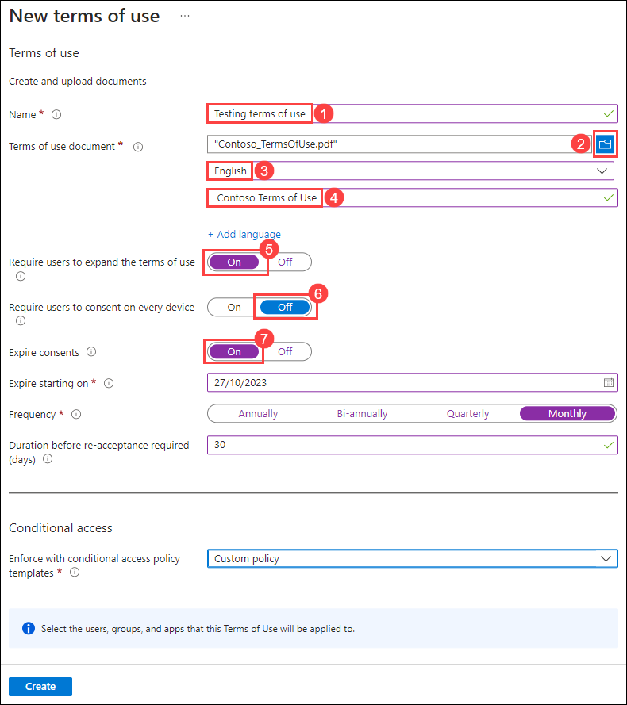

6. When **Expire consents** is set to **On**, two additional schedule settings are displayed:

    

7. Use the **Expire starting on (1)** and **Frequency (2)** settings to specify the schedule for terms of use expirations. The following table shows the result for a couple of example settings:

    | Expire starting on | Frequency | Result |
    |---|---|---|
    | Today's date | Monthly | Starting today, users must accept the terms of use and then reaccept every month.|
    | Date in the future | Monthly | Starting today, users must accept the terms of use. When the future date occurs, consents will expire and then users must reaccept every month. |

    >**Note:** For example, if you set the expire starting on date to **Jan 1** and frequency to **Monthly**, here is how expirations might occur for two users:

    | User | First accept date | First expire date | Second expire date | Third expire date |
    |---|---|---|---|---|
    | Alice | Jan 1 | Feb 1 | Mar 1 | Apr 1|
    | Bob | Jan 15 | Feb 1 | Mar 1| Apr 1 |

     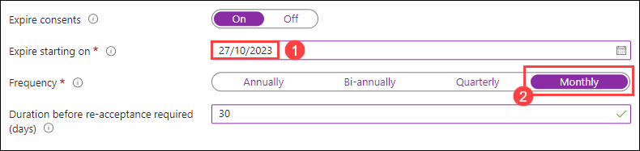

8. Use the **Duration before re-acceptance requires (days)** setting to specify the number of days before the user must reaccept the terms of use. This allows users to follow their own schedule. For example, if you set the duration to **30** days, here is how expirations might occur for two users:

    | User | First accept date | First expire date | Second expire date | Third expire date |
    |---|---|---|---|---|
    | Alice | Jan 1 | Jan 31 | Mar 2 | Apr 1|
    | Bob | Jan 15 | Feb 14 | Mar 16| Apr 15

    >**Note:** It is possible to use the Expire consents and Duration before re-acceptance requires (days) settings together, but typically you use one or the other.

   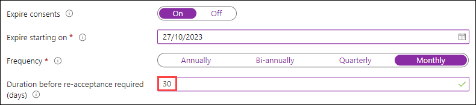

9. Under **Conditional Access**, select **Custom policy (1)** and then click on **Create (2)**.

    | Template | Description |
    |---|---|
    | **Access to cloud apps for all guests** | A Conditional Access policy will be created for all guests and all cloud apps. This policy impacts the Azure portal. Once this is created, you might be required to sign-out and sign-in. | 
    |**Access to cloud apps for all users** | A Conditional Access policy will be created for all users and all cloud apps. This policy impacts the Azure portal. Once this is created, you will be required to sign-out and sign-in. |
    | **Custom policy** | Select the users, groups, and apps that this terms of use will be applied to. |
    | **Create Conditional Access policy later** | This terms of use will appear in the grant control list when creating a Conditional Access policy. |

    

    >**IMPORTANT:** Conditional Access policy controls (including terms of use) do not support enforcement on service accounts. We recommend excluding all service accounts from the Conditional Access policy.

    >**Note:** Custom Conditional Access policies enable granular terms of use, down to a specific cloud application or group of users. For more information, see [https://docs.microsoft.com/en-us/azure/active-directory/conditional-access/require-tou](https://docs.microsoft.com/en-us/azure/active-directory/conditional-access/require-tou).

10. When the terms of use is created, you will automatically be redirected to the Conditional access policy page. On the page,
    - **Name:** Enter **Enforce ToU (1)**.
    - Under **Assignments**, click on **Users (2)**.
    - Within the **Include** tab, ensure to choose **Select users and groups (3)** radio button.
    - Select the **Users and groups (4)** checkbox.
    - Under **Select**, click on **0 users and groups selected (5)** to add the new user who would be alligned to this conditional access policy.
    - In the Select pane, select **Alex Wilber (6)** account to use to test the terms and policy.
    - Click on **Select (7)**.

    >**Note:** Do not select the ODL_user <inject key="DeploymentId" enableCopy="false" /> which can be used to ensure that your administrator account does not get locked out.
    
    >**Warning:** If you choose your administrator account, like all conditional access policies, be sure you have another account with enough permissions to change the conditional access policy. This is to ensure your administrator account will not be locked out should the conditional access policy result in an undesirable outcome.

    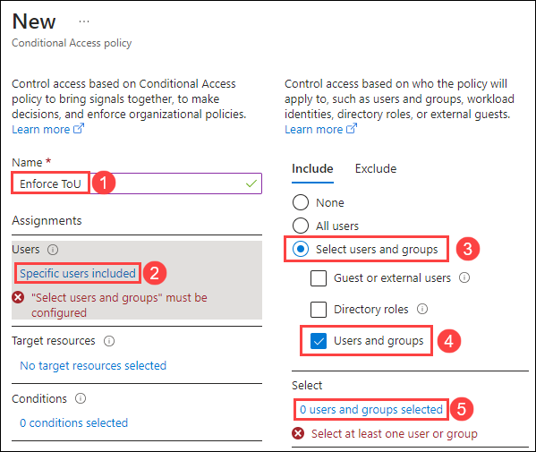
    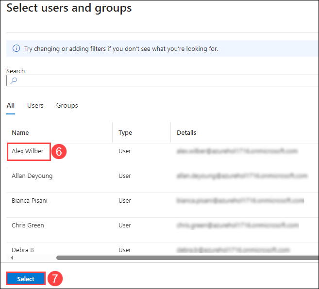

11. In order to implement terms of use over a specific app for the user, execute the following configurations while creating the conditional access policy:
    - Under the **Target resources** section, click on **No target resources selected (1)**.
    - Ensure to have **Cloud apps (2)** option selected from the dropdown list.
    - Within the **Include** tab, choose the **All cloud apps (3)** radio button.

       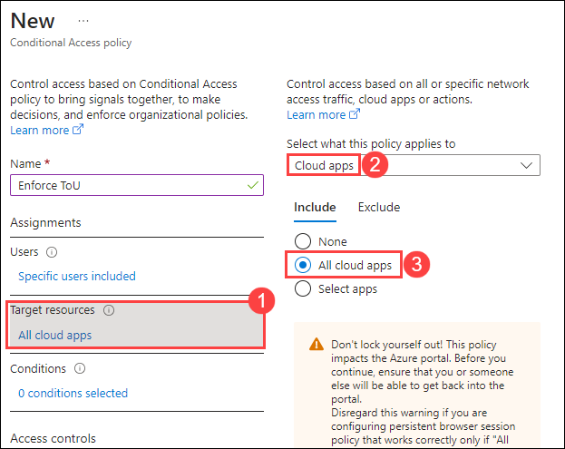

12. To provide control access enforcement to block or grant access, perform the following:
    - Under **Access controls**, select **0 controls selected (1)**.
    - In the Grant pane,
        - Select the **Grant access (2)** radio button.
        - Ensure to check the **Testing terms of use (3)** checkbox.
        - Click on **Select (4)**.
        - Under **Enable policy**, select **On (5)**.
        - When complete, select **Create (6)**.
    
         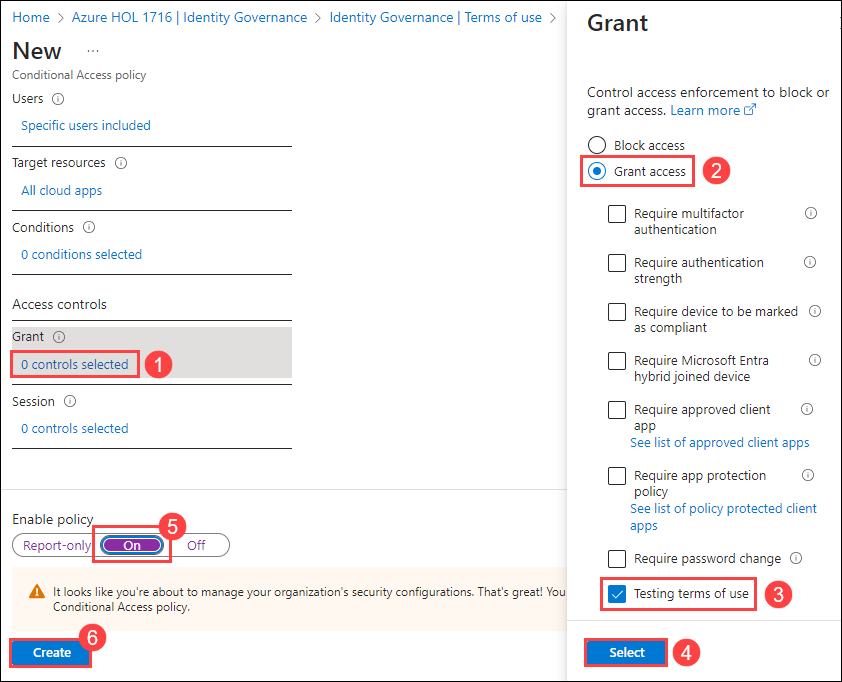

         >**Note:** There may be scenarios in which you may be produced with an error message stating that the Security defaults must be disabled to enable conditional access policy. In such cases, the account being provided may have the security defaults set to enabled for MFA functionality. It is recommended to disable the security default before proceeding with this lab. Follow the below instructions:
    - Click on the **disable security defaults** from the warning that displays as shown in the below screenshot.
      
       
    
    - Within the Security defaults page, ensure that the option - **Disabled (1)** is selected.
    - Select a reason for disabling - **Too many sign-in multifactor authentication challenges (2)**
    - Click on **Save (3)**

      

13. If you choose to use your own account, you can refresh your browser. You will be prompted to sign in again. When you sign in, you will be required to accept the terms of use.

    > **Congratulations** on completing the task! Now, it's time to validate it. Here are the steps:
    > - Navigate to the Lab Validation Page, from the upper right corner in the lab guide section.
    > - Hit the Validate button for the corresponding task. If you receive a success message, you can proceed to the next task. 
    > - If not, carefully read the error message and retry the step, following the instructions in the lab guide.
    > - If you need any assistance, please contact us at labs-support@spektrasystems.com. We are available 24/7 to help you out.

### Task 2: Log in as an user

1. Open a new **InPrivate** browser window.

2. Connect to `https://portal.azure.com`.

    >**Note:** If if comes up saying you are already logged in, select on the logged in users name in the upper-right corner of the screen and choose **Sign in with a different account**.

3. Log in as Alex Wilber:

    | Setting | Value to enter |
    | :--- | :--- |
    | User Name | **alex.wilber@** `<<your domain name>>.onmicrosoft.com` |
    | Password | Enter the password for Alex |

4. To find the username for Alex, login to the Azure portal using the credentials given in the **Environment Details** page navigate to the Users section of the Microsoft Entra ID, and copy the user name.

5. From the Microsoft Entra ID **Users** section, click on **Alex Wilber** user, and from the top navigation pane click on **Reset Password** and copy the temporary password and login and reset the password to **Pa55w.rd@123**

4. Validate Alex's login with the MFA request:
    - View the Terms of Use **(1)**.
    - Choose to **Accept (2)**.

      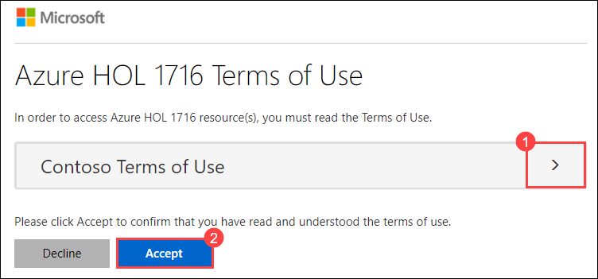

       >**Note:** If you choose **Decline** then during a future login as Alex Wilber, you will again be required to view and accept the Terms of Use.

       >**Note:** Terms of Use may take a few minutes to appear or you can logout and log back in to the portal.
 
### Task 3: Review the report of acceptance and rejection records

The Terms of use page shows a count of the users who have accepted and declined. These counts and who accepted/declined are stored for the life of the terms of use.

1. In Microsoft Azure portal, navigate to **Microsoft Entra ID** and select **Identity Governance**  and subsequently select **Terms of use** and locate the terms of use that was newly created.
  
2. In this lab execution, since the **Accepted** value was selected. You can see the reported user information for those that have accepted the terms of use from the **View Audit Logs** section from the top navigation pane.

3. On the **Audit Logs** page from the top navigation pane , select **Download** to download a consents report and subsequently select **json** and click on **Download** to view the report.

4. On the **Identity Governance | Terms of Use** page, highlight **Testing terms of use** and select **View selected audit logs** to view the audit logs activity.

### Task 4: What terms of use looks like for users [Read Only]

1. Once a terms of use is created and enforced, users who are in scope will see the terms of use page.

    

2. Users can view the terms of use and, if necessary, use buttons to zoom in and out.

    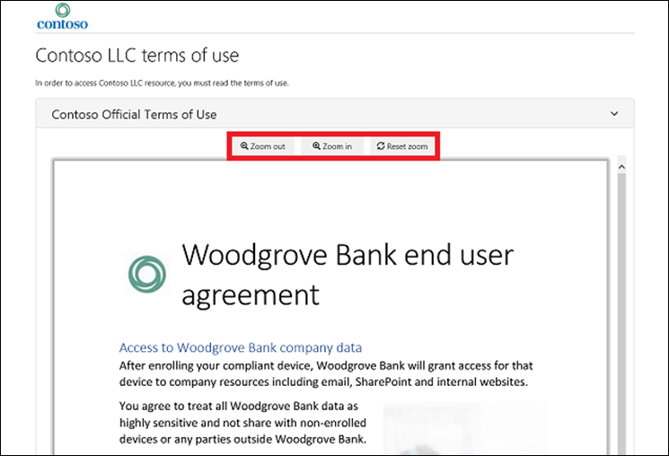

3. On mobile devices, the terms of use will be displayed similar to the following example.

    

### Task 5: How users can review their terms of use

Users can review and see the terms of use that they have accepted by using the following procedure.

1. Open a new In-private browser and navigate to [https://myapps.microsoft.com](https://myapps.microsoft.com/).

2. Sign in using your ODL Administrator user account to sign in:

   | Setting | Value |
   | :--- | :--- |
   | Username | **<inject key="AzureAdUserEmail" enableCopy="true" />** |
   | Password | **<inject key="AzureAdUserPassword" enableCopy="true" />** |

   >**Note:** If you are already signed in as Alex, kindly sign out and log in with the above credentials.

3. Select the user profile photo and then select **View account**. On the Overview page, select **VIEW SETTINGS AND PRIVACY**.

    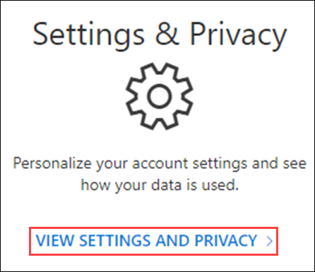

4. On the Settings & Privacy page, select the **Privacy** tab.

    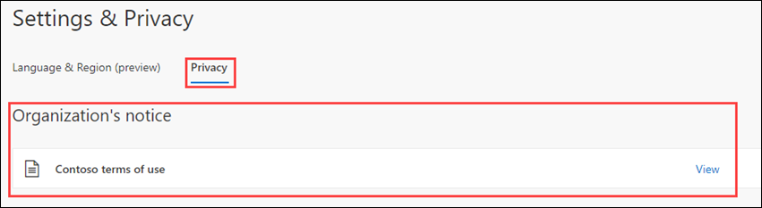

5. Under **Organization’s notice**, you can review the terms of use you have accepted.

### Task 6: Edit terms of use details 

You can edit some details of terms of use, but you can't modify an existing document. The following procedure describes how to edit the details.

1. In Azure Portal, in **Search resources, services and docs** type **Microsoft Entra ID** and select it.

    

2. On the Microsoft Entra ID page, from the left-hand navigation page, under **Manage**, select **Identity Governance**.

    

3. In the left navigation menu, under **Terms of use**, select **Terms of use**.

4. To edit the terms of use details:
    - Select **Testing terms of use (1)**
    - On the top menu, select **Edit terms (2)**.

    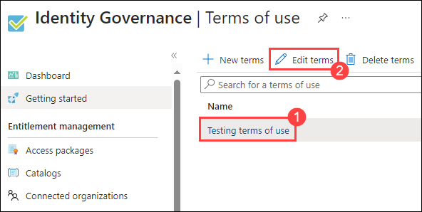

    >**Note:** In the Edit terms of use pane, you can change the following:
    >- **Name:** This is the internal name of the ToU that is not shared with end users. 
    >- **Require users to expand the terms of use:** Setting this to **On** will force the end use to expand the terms of use document before accepting it.
    >- **Update an existing terms of use** document.
    >- You can add a language to an existing ToU If there are other settings you would like to change, such as require users to consent on every device, expire consents, duration before reacceptance, or Conditional Access policy, you must create a new terms of use.

      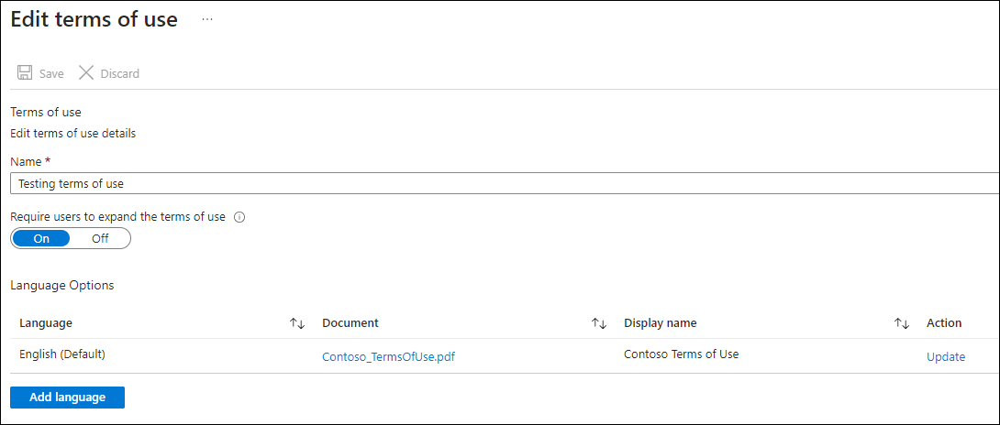

5. In the **Language Options** table, identify the terms of use language you want to update and then, in the **Action** column, select **Update**.

    

6. The Update terms of use version pane will look like as shown as below    

    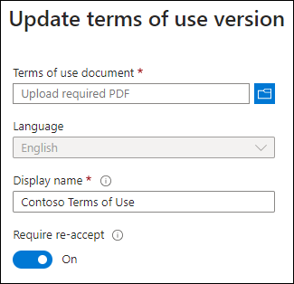

    >**Note:** You can also upload a new version of the  **Terms of Use Document** and choose the language of your choice.

7. Additionally, you can use the **Require reaccept** toggle button if you want to require your users to accept this new version the next time they sign in. If you do not require your users to re-accept, their previous consent will stay current and only new users who have not consented before or whose consent expires will see the new version.

8. Once you have uploaded your new pdf and decided on re-accept, select **Add**.

9. You will now see the most recent version under the Document column.

## Review

In this lab you have completed the following tasks:

- Adding terms of use
- Logging in as an user
- Review the report of aceptance and rejection records
- What terms of use looks like for users
- How users can review their terms of use
- Editting terms of use details

### You have successfully completed the lab
