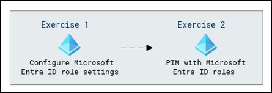
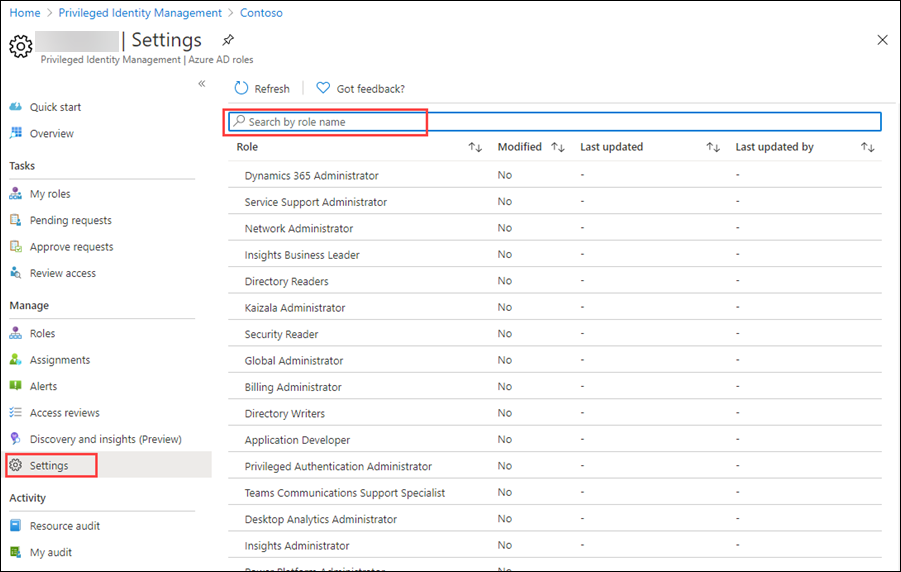
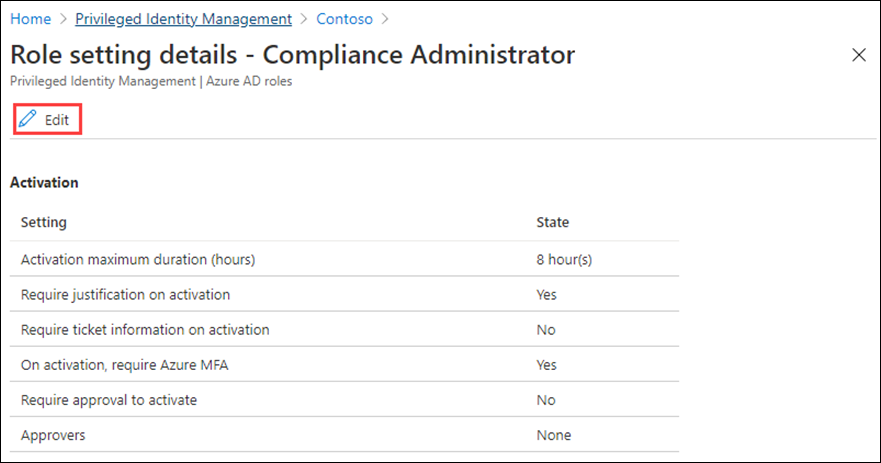
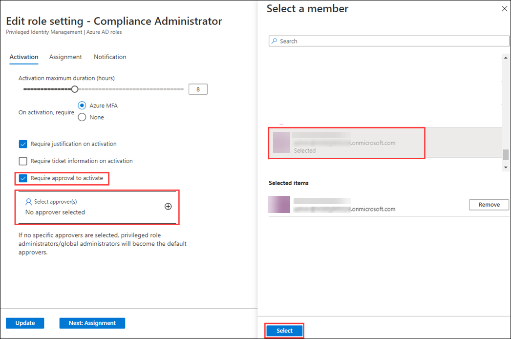
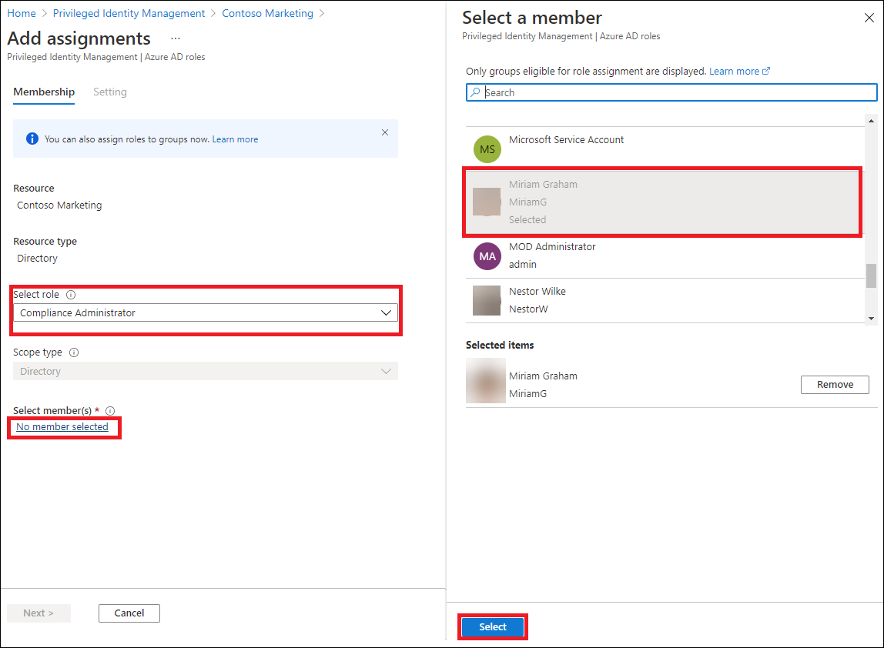
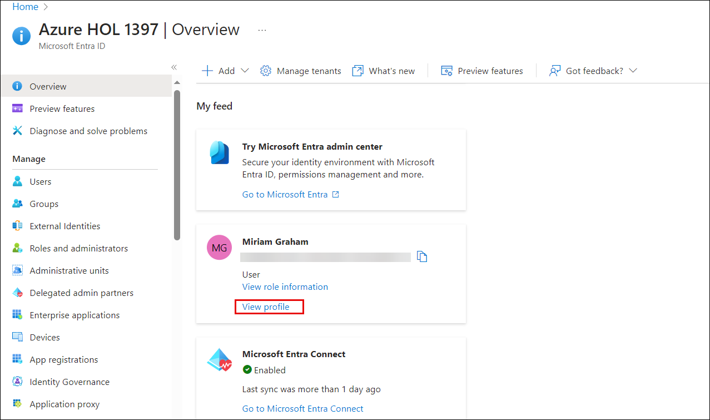
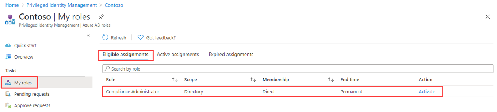
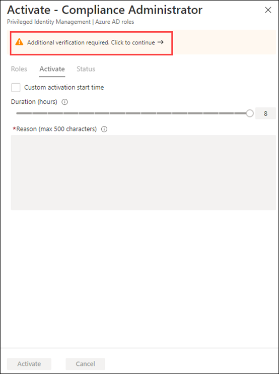

# Lab 26: Configure Privileged Identity Management for Microsoft Entra ID roles

## Lab scenario

A Privileged role administrator can customize Privileged Identity Management (PIM) in their Azure Active Directory (Azure AD) organization, including changing the experience for a user who is activating an eligible role assignment. You must become familiar with configuring PIM.

## Lab Objectives
After completing this lab, you will be able to:
- Exercise 1 - Configure Microsoft Entra ID role settings
- Exercise 2 - PIM with Microsoft Entra ID roles

## Architecture Diagram

#### Estimated time: 30 minutes

### Exercise 1 - Configure Microsoft Entra ID role settings

#### Task 1 - Open role settings

Follow these steps to open the settings for an Azure AD role.

2. In the Azure portal, search for and  select **Microsoft Entra ID Privileged Identity Management.**

3. In the Privileged Identity Management page, in the left navigation, select **Microsoft Entra ID roles.**

4. On the Quick start page, in the left navigation, select **Settings.**

    

5. Review the list of roles and then, in the **Search by role name**, enter **compliance**.

6. In the results, select **Compliance Administrator**.

7. Review the role setting details information.

#### Task 2 - Require approval to activate

If setting multiple approvers, approval completes as soon as one of them approves or denies. You cannot require approval from at least two users. To require approval to activate a role, follow these steps.

1. In the Role setting details page, on the top menu, select **Edit**.

    

2. In the Edit role setting – Compliance Administrator page, select the **Require approval to activate** check box.

3. Select **Select approvers**.

4. In the Select a member pane, select your administrator account and then select **Select**.

    

5. Once you have configured the role settings, select **Update** to save your changes.

### Exercise 2 - PIM with Microsoft Entra ID roles

#### Task 1 - Assign a role

With Microsoft Entra ID, a Global administrator can make permanent Microsoft Entra ID admin role assignments. These role assignments can be created using the Azure portal or using PowerShell commands.

The Microsoft Entra ID Privileged Identity Management (PIM) service also allows Privileged role administrators to make permanent admin role assignments. Additionally, Privileged role administrators can make users eligible for Microsoft Entra ID admin roles. An eligible administrator can activate the role when they need it, and then their permissions expire once they're done.

Follow these steps to make a user eligible for an Azure AD admin role.

1. Search for and then select **Microsoft Entra ID Privileged Identity Management.**

2. In the Privileged Identity Management page, in the left navigation, select **Microsoft Entra ID roles.**

3. On the Quick start page, in the left navigation, under Manage select **Roles**.

4. On the top menu, select **+ Add assignments.**

    

5. In the Add assignments page, on the **Membership** tab, review the settings.

6. Select the **Select role** menu and then select **Compliance Administrator**.

7. You can use the **Search role by name** filter to help located a role.

8. Under **Select member(s),** select **No members selected**.

9. In the Select a member pane, select **Miriam Graham** and then select **Select**.

   

10. In the Add assignments page, select **Next**.

11. On the **Settings** tab, under **Assignment type**, review the available options. For this task, use the default setting.

    - Eligible assignments require the member of the role to perform an action to use the role. Actions might include performing a multi-factor authentication (MFA) check, providing a business justification, or requesting approval from designated approvers.
    - Active assignments do not require the member to perform any action to use the role. Members assigned as active have the privileges always assigned to the role.

12. Review the remaining settings and then select **Assign**.

#### Task 2 - Log in with Miriam

1. Open a new InPrivate browser window.
2. Connect to the Azure Portal (https://portal.azure.com).
3. If it opens with a user logged in, Select on their name in the upper-right corner and select **Sign in as a different account**.
4. Log in a Miriam.

   | Field | Value |
   | :--- | :--- |
   | Username | **MiriamG@** `<<your domain.onmicrosoft.com>>` |
   | Password |  Enter the password for Miriam Graham |

   >**Note:** To find the username for Miriam Graham, login to the Azure portal and navigate to the Users section of the Microsoft Entra ID, and copy the user name.

   >**Note:** From the Microsoft Entra ID **Users** section, click on **Miriam Graham** user and from the upper tab click on **Reset Password** and subsequently click on **Reset Password**  again and copy the temporary password and login to office.com and reset the password to **Pa55w.rd@123**

5. Close the **Welcome to Azure dialog**.
6. From the **Search resource, services, and docs** bar look for Microsoft Entra ID, and open the page.
7. On the **Overview** page, look for the **My feed**.
8. Select **View Profile** under Miriam Graham's name; this with open Miriam's profile page.

   

10. From the left navigation pane,under Manage select **Assigned roles** then select **Eligible assignments**.
11. Notice that the **Compliance Administrator** role is now available to Miriam.

#### Task 3 - Activate your Azure AD roles

When you need to assume an Azure AD role, you can request activation by opening **My roles** in Privileged Identity Management.

1. From the **Search, resources, services, and docs** bar, look for Privileged.
2. Open the **Azure AD Privileged Identity Management** page.
3. On the Privileged Identity Management page, in the left navigation menu, select **My roles.**

4. In the My roles page, review the list of eligible assignments.

    

5. In the Compliance Administrator role row, select **Activate**.

6. In the Activate – Compliance Administrator pane, select **Additional verification required** and then follow the instructions to provide additional security verification. You are required to authenticate only once per session.

    

    >**Verification** - Based on our current lab environment configuration, you will be required configure MFA and log in successfully.
    
    >**Note:** In the MFA window select **I want to set up a different method** and choose **Phone** and complete the additional verification process.

7. After you have completed the additional security verification, back in the Azure portal, in the **Activate – Compliance Administrator** pane, in the **Reason** box, enter the **This is my justification for activating this role**.

    >**Important Note** - The principal of least privilege, you should only activate the account for the amount of time you need it.  If the work needed to be done, only takes 1.5 hours, then set the duration to two hours.  Similarily, if you know that you won't be able to do the work until after 3 p.m., choose a Custom activation time.

8. Select **Activate**.

#### Task 4 - Assign a role with restricted scope

For certain roles, the scope of the granted permissions can be restricted to a single admin unit, service principal, or application. This procedure is an example if assigning a role that has the scope of an administrative unit.

1. Now, go to the portal where you have logged in as the ODL user in the normal Microsoft Edge browser.
2. Browse to the Privileged Identity Management page, and in the left navigation menu, select Azure **Microsoft Entra ID roles.**
3. Under Manage select **Roles**.
4. In the Roles page, on the top menu, select **+ Add assignments.**

5. In the Add assignments page, select the **Select role** menu and then select **User administrator.**

6. Select the **Scope type** menu and review the available options. For now, you will use the **Directory** scope type.

   >**Tip** - Go to [https://docs.microsoft.com/en-us/azure/active-directory/roles/admin-units-manage](https://docs.microsoft.com/en-us/azure/active-directory/roles/admin-units-manage) for more information about the administrative unit scope type.

7. As you did when assigning a role without a restricted scope, you would add members and complete the settings options. For now, select **Cancel**.

#### Task 5 - Update or remove an existing role assignment

Follow these steps to update or remove an existing role assignment.

1. In the Open Azure AD Privileged Identity Management > Microsoft Entra ID roles page, in the left navigation, select **Assignments**.

2. In **Assignments** list, for Compliance Administrator, review the options in the **Action** column.

    

3. Select **Update** and review the options available in the Membership settings pane. When complete, close the pane.

4. Select **Remove**.

5. In the **Remove** dialog box, review the information and then select **Yes**.

## Review
In this lab you have completed the following tasks:
- Configured Azure AD role settings
- Configured PIM with Azure AD roles

## You have successfully completed the lab
