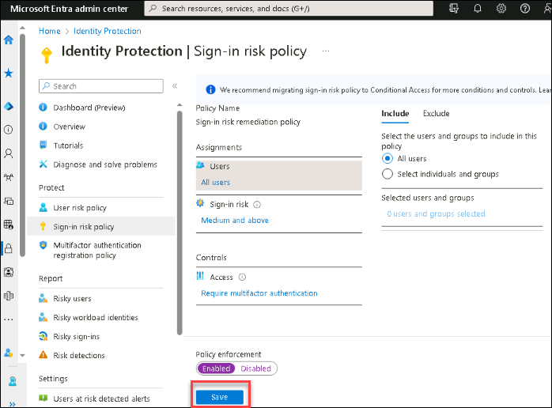

# Lab 28 - Monitor and managed security posture with Identity Secure Score

## Lab scenario

Azure AD Identity Protection provides automated detection and remediation to identity-based risks, and provides data in the portal to investigate potential risks. Azure AD Identity Protection also provide an Identity Secure Score to monitor and improve your identity security posture.  In the same manner as Microsoft 365 Defender and Microsoft Defender for Cloud, Identity Secure Score provides improvement actions and recommendations that can improve your overall security posture for identity in Azure Active Directory.  This lab will explore this capability. 

## Lab objectives
In this lab, you will complete the following tasks:

+ Task 1 - Review Identity Secure Score and improvement actions
+ Task 2 - Execute an improvement action

## Architecture Diagram

#### Estimated time: 15 minutes

## Architecture diagram

### Exercise 1 - Using Identity Secure Score to monitor and manage identity security posture

#### Task 1 - Review Identity Secure Score and improvement actions

1. Sign in to the [https://entra.microsoft.com/](https://entra.microsoft.com/).

2. Search for and then select **Protection > Identity Secure Score** to view the dashboard.

3. In the **Identity Secure Score** This will take you to the Identity Secure Score dashboard.

4. Scroll down to view the **Improvement actions**.

5. In contrast to the improvement actions in Microsoft Defender for Cloud and Microsoft 365 Defender, these improvement actions are specific to identity.  This provides a more focused list of potential actions to your security posture management.  Any improvement actions initiated from this list will also provide an impact to your overall tenant security posture. 

#### Task 2 - Execute an improvement action

1. Select **Identity Protection | Sign-in risk policy** from left panel.

2. Select **All users** under **Assignments**.

3. Select **low and above** under Sign-in risk and then select **Medium and above**.

4. Select **Allow** - **Require multi-factor authentication** under **Controls**.

5. Turn the **Policy enforcement** to **Enabled** (if not done so already), and select **Save**.

   

6. You have created a Sign-in risk policy that should now increase your Identity Secure Score.  This will take up to 24 hours to take affect in your Identity Secure Score.

8. Review other improvement actions and the steps to create and enable them.

### Review
In this lab, you have completed:
- Review Identity Secure Score and improvement actions
- Execute an improvement action

### You have successfully completed the lab
